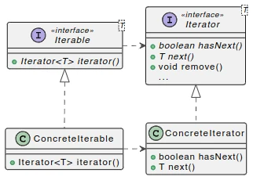
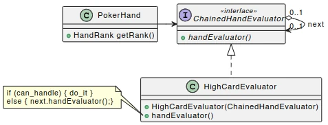
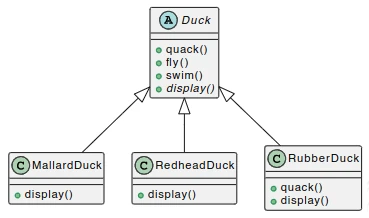
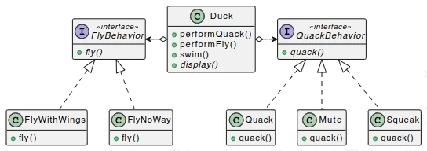
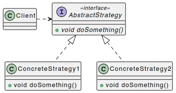
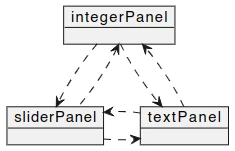
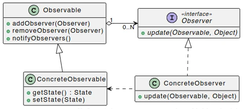
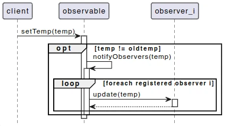
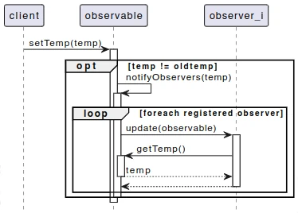

# **10. Design patterns<br>[[ST 8](../Slide%20teoria/08.pdf?page=10), [ST 9](../Slide%20teoria/09.pdf?page=5) e [ST 10](../Slide%20teoria/10.pdf?page=2)] ([VL 15](https://youtu.be/oI6kqwNmIpU?t=3523), [VL 17](https://youtu.be/sGJjZlr9owo?t=3563) e [VL 19](https://www.youtube.com/watch?v=hH6h6Cjir04))**


## **10.1. Design pattern**

I **design patterns** sono delle soluzioni architetturali (concettuali, di progettazione) a problemi ricorrenti realizzabili in qualsiasi linguaggio di programmazione.

Un **anti-pattern** è una soluzione che potrebbe sembrare buona, ma in realtà non lo è.

Un **idioma** è la realizzazione specifica di un certo pattern in un linguaggio che ha delle caratteristiche peculiari che rendono più semplice tale realizzazione.

## **10.2. Meta pattern**

Spesso quando s'identifica un concetto, si vuole anche parlare di quel concetto. [articolo](../Articoli/Metapatterns.pdf).

Identifica due concetti base con cui poi si può ragionare sugli altri pattern e sull'object orientation in generale e i meccanismi di design in genrale:
- **hook method**  (*punto caldo* o *hotspot*): è un metodo astratto che determina il comportamento specifico delle sottoclassi una volta che vado a ridefinire. è nell'Interfaccia o classe astratta mentre la versione concreta in cui funziona in questa maniera è nella classe.
- **template method** (*elemento freddo*): scheletro che coordina più hook method, è l'elemento d'invariabilità del pattern. È il codice che eredito dal pattern, dato che ho questo pattern copio incollo, non cambia in base alle circostanze (si adatta alle varie situazioni con degli hook che vengono ridefiniti nelle classi sottostanti).

Queste due cose come si possono provare?

1. Potrebbero essere in una sola classe. Classe con templatemethod definito e hook astratto, chi la estende si ritrova il template e ridefinisce l'hook.

1. separiamo le due cose, una template class che contiene 1..N hook class che definiscono degli hook method, il template usa l'hook method ma sono in due classi separate. È ancora più statico, la classe template non la tocco neanche, definisco solo una nuova hookclass.

1. un metodo è sia hook che template, significa che è astratto ma ne esiste una versione realizzata che richiama ricorsivamente questo stesso metodo. Vuol dire che il templatehookmetod richiama non solo il proprio codice ma anche il templatehookmethod della sottoclasse.

## **10.3. Gang of four patterns**

Erich Gamma, Richard Helm, Ralph Johnson e John Vlissides hanno definito 23 pattern e li hanno classificati in tre diverse categorie in base al problema che cercano di risolvere:
- **Creazionali**: come vengono creati gli oggetti.
- **Comportamentali**: come si comportano gli oggetti e come interagiscono tra loro.
- **Strutturali**: come gli oggetti sono staticamente collegati tra di loro (non come evolvono dinamicamente nel tempo).

Questi 23 pattern comprendono anche quelli riportati successivamente.

## **10.4. Singleton pattern**

Il singleton pattern è utile quando si cerca di definire un oggetto (inteso come singola istanza) e non una classe in un linguaggio che fonisce solo il concetto di classe. L'uso di questo pattern garantisce che in qualsiasi momento una certa classe possa avere al massimo **una sola istanza** (Es: tabella dei file aperti in un SO, questa deve essere unica e condivisa).

Per fare questo è necessario rendere privato (o protetto per permettere la creazione di sottoclassi) il costruttore della classe, altrimenti chiunque può creare una nuova istanza. Occorre poi creare un metodo statico ```getInstance()``` che restituisce l'oggetto singleton, trovandosi all'interno della classe questo può accedere al costruttore per creare l'unica istanza che verrà utilizzata.

```java
public class Singleton{

    private static Singleton instance = null;

    protected Singleton(){ /* codice costruttore */ }

    public static Singleton getInstance(){
        if(instance == null) instance = new Singleton();
        return instance;
    }

    public void sampleOp(){ /* codice metodo */ }

}
```

Quest'implementazione crea l'unica istanza solo quando questa viene richiesta per la prima volta (*approccio lazy* o *pigro*), ma garantisce davvero che possa esistere una sola istanza? Nei sistemi moderni tutto viene eseguito in concorrenza, quindi potrebbe presentarsi il problema del **test e set non atomico**.

Se un primo thread viene fermato subito dopo aver eseguito il confronto ```instance == null```, ed il controllo passa ad un secondo thread che esegue anche lui il confronto, creerà una nuova istanza perchè ```instance``` vale ```null```. Quando il primo thread riprenderà la sua esecuzione, creerà una seconda istanza che andrà a sovrascrivere la prima. Da questo momento chiunque chiamerà ```getInstance``` riceverà la seconda istanza, però alcuni oggetti potrebbero avere (anche permanentemente) un riferimento alla prima.

Una possibile soluzione consiste nell'aggiungere la keyword ```synchronized``` al metodo ```getInstance```, in modo che venga eseguito in mutua esclusione. Però così facendo le performance del metodo calano notevolmente (viene usato un lock a livello di so e non di programma).

Dato che l'unica chiamata che si vuole gestire in modo sincornizzato è solo la prima, si può effettuare un doppio controllo: se ```instance == null``` si entra in un blocco sincronizzato in cui si ripete lo stesso controllo ed eventualmente si crea l'istanza. In questo modo si ha un test e set atomico, inoltre dopo la prima chiamata il blocco sincronizzato non verrà più eseguito, quindi le prestazioni non peggiorano.

```java
public static synchronized void createInstance(){
    if(instance == null) instance = new Singleton();
}

public static Singleton getInstance(){
    if(instance == null) createInstance();
    return instance;
}
```

Questa soluzione non funzionava nelle versioni di Java precedenti alla 5 perchè prima veniva assegnato un indirizzo ad ```instance```, e solo dopo veniva inizializzato l'oggetto. Questo signfica che se un thread veniva interrotto durante la creazione dell'istanza, un altro thread vedendo ```instance``` diverso da ```null``` avrebbe cercato di usare l'oggetto non ancora completamente inizializzato. Successivamente la traduzione del codice in bytecode è stata cambiata e l'errore è stato corretto.

Anche se la soluzione precedente sembra perfetta, non è quella consigliata da usare in Java, infatti è preferibile usare il seguente *idioma*:

```java
public enum Singleton{
    
    INSTANCE;
    
    public void sampleOp(){ /* codice metodo */ };

}
```

Per ogni valore di un enumerativo, Java crea un unica istanza condivisa nel momento in cui questa viene richesta per la prima volta (di fatto ognuno di questi è un singleton). Quest'implementazione permette di avere varie caratteristiche thread safe già inglobate scrivendo meno codice (che è però anche meno chiaro).

## **10.5. Iterator pattern**

L'iterator pattern fornisce un modo per **accedere sequenzialmente agli elementi di un oggetto aggregatore senza esporne la rappresentazione interna**. In Java viene realizzato mediante l'implementazione dell'interfaccia ```Iterator```.

```java
public interface Iterator<T>{

    boolean hasNext();

    T next();
    
    default void remove() {
        throw new UnsupportedOperationException("remove");
    }
    
    default void forEachRemaining(Consumer<? super T> action){
        Objects.requireNonNull(action);
        while(hasNext()) action.accept(next());
    }

}
```

Quest'interfaccia ha diversi metodi:
- ```hasNext```: restituisce ```true``` se ci sono ancora elementi da scorrere, altrimenti restituisce ```false```.
- ```next```: restituisce l'elemento successivo.
- ```remove```: rimuove dall'oggetto aggregatore l'ultimo elemento ritornato da ```next```. L'implementazione di default solleva un eccezione, se si desidera rendere possibile la rimozione è necessario sovrascriverlo nelle sottoclassi.
- ```forEachRemaining```: esegue un azione su ogni elemento che rimane da scorrere.

L'interfaccia ```Iterator``` è usata anche all'interno d'```Iterable```, la sua particolarità è l'avere un metodo ```iterator``` che ritorna un iteratore.

```java
public interface Iterable<T>{

    Iterator<T> iterator();

    default void forEachRemaining(Consumer<? super T> action){ /* codice metodo */ }

    default Spliterator<T> spliterator(){ /* codice metodo */ }

}
```



In Java spesso si preferisce fare in modo che una classe aggregatrice implementi ```Iterable```, in modo che sia possibile usare il ciclo for esteso (**foreach**). Il metodo ```iterator``` può anche essere implementato come un semplice return di una nuova istanza di una classe anonima che implementa ```Iterator```.

```java
// Uso d'Iterator
Iterator<Card> it = cards.iterator();
while(it.hasNext())
    doSomethingWith(is.next())

// Uso d'Iterable
for(Card card : cards)
    doSomethingWith(card);
```

## **10.6. Chain of responsibility**

Questo pattern permette di **definire una catena di potenziali gestori di una richiesta** di cui non si sà a priori chi sarà in grado di gestirla effettivamente.

Quando un client ha bisogno che venga effettuato un compito e vuole affidarne la gestione a qualcun altro, può essere una buona idea creare una catena di elaborazione, soprattutto quando risulta comodo suddividere tale compito in parti distinte non per forza separate (Es: regole di un antispam).

Ogni gestore della catena cerca di determinare il risultato, nel caso in cui questo non sia possibile cede il compito al prossimo gestore (delega). L'ordine in cui sono stati messi i gestori (priorità di validazione regole) permette di configurare il funzionamento di questo pattern.



```java
public interface Handler{

    Result handleRequest(Data data);

}
```

```java
public class ConcreteHandler implements Handler{

    private Handler next;

    public ConcreteHandler(final Handler next){
        this.next = next;
    }

    @Override
    public Result handleRequest(final @NotNull Data data){
        if(canHandleRequest(data)) return createResult(data);
        if(next != null) return next.handleRequest(data);
        return null;
    }

    private boolean canHandleRequest(final @NotNull Data data){
        /* codice metodo */
    }

    private Result createResult(final @NotNull Data data){
        /* codice metodo */
    }

}
```

```java
public class Client{

    private Handler chain = new ConcreteHandler1(new ConcreteHandler2( new ConcreteHandler3(null)));

    private void doSomething(){
        /* codice metodo */
        Result result = chain.handleRequest(getData());
        /* codice metodo */
    }

    private Data getData(){
        /* codice metodo */
    }

}
```

Questo pattern permette d'avere un enorme flessibilità a discapito delle prestazioni, prima di trovare il risultato potrebbe essere necessario passare attraverso molte chiamate. Per mitigare questo calo di prestazioni si consiglia di creare catene corte o di effettuare test immediati per capire se la richiesta è gestibile.

Un altro vantaggio offerto da questo pattern è la riconfigurabilità della catena durante l'esecuzione, si possono usare algoritmi di apprendimento che modificano la catena per migliorarne l'efficacia.

## **10.7. Flyweight pattern**

Quando delle istanze equivalenti diventano fortemente condivise all'interno del programma diventano auspicabili sia immutabilità che unicità.

Il flyweight pattern serve a **gestire una collezione di oggetti immutabili assicurandone l'unicità** (crea un unico esemplare invece che creare più oggetti immutabili identici). A differenza del singleton deve contenere più istanze, quindi ha senso usarlo quando non si conosce a priori il numero d'istanze o se queste sono troppe per essere enumerate.

Esempio: creazione delle carte da gioco.

```java
public class Card{

    private static final Card[][] CARDS = new Card[Rank.values().length][Suit.values().length];

    static {
        for(Rank rank : Rank.values())
            for(Suit suit : Suit.values())
                CARDS[rank.ordinal()][suit.ordinal()] = new Card(rank, suit);
    }

    public static Card get(Rank rank, Suit suit){
        return CARDS[rank.ordinal()][suit.ordinal()];
    }

}
```

In questo esempio viene usato un costruttore statico (blocco d'inizializzazione) per costruire tutte le carte possibili e memorizzarle all'interno di una matrice. Questo non è un approccio lazy: tutte le carte vengono inizializzate alla partenza, anche quelle che non verranno mai usate.

## **10.8. Delegation/Strategy pattern**

Si consideri il seguente schema delle classi:



La classe astratta ```Duck``` implementa alcuni metodi che tutte le papere sono in grado di fare (```quack``` e ```swim```), però il metodo ```display``` è astratto perchè si vuole raffigurare varie specie di papere in modo diverso (viene ridefinito dalle sottoclassi).

Aggiungere una sottoclasse ```RubberDuck``` è un operazione pericolosa perchè in futuro il creatore di ```Duck``` potrebbe voler aggiungere un metodo ```fly```, a lui questo non causa problemi ma a chi ha realizzato ```RubberDuck``` si (le paperelle di gomma non volano). Questo problema si verifica perchè si sta modificando una classe esistente per aggiungere una funzionalità (violazione dell'open-closed principle).

Il problema si potrebbe risolvere facendo l'override di ```fly``` in ```RubberDuck``` dicendo che la paperella di gomma non può volare, così però si violerebbe anche il principio di sostituzione di Lyskov (peggio di prima!) oppure rendendo ```Duck``` una classe ```sealed``` (dichiara esplicitamente quali classi hanno il permesso di estenderla).

Una soluzione migliore è quella in cui si crea un interfaccia per ogni capacità (eventualmente con metodi di default) e ad ognuna si danno diverse implementazioni, in modo che quando si chiama un metodo, l'azione venga delegata all'implementazione specifica usata dalla sottoclasse (questo approccio è comunuqe limitato, non si possono usare attributi nell'interfaccia).



Rimane però vantaggioso rispetto agli altri approcci perchè il come si esegue un certa azione viene scritto una volta sola, inoltre è possibile dare più staticità/dinamicità al pattern: si può assegnare un implementazione dell'interfaccia nel costruttore e non cambiarla mai o pensare che il comportamento possa cambiare nel corso del tempo tramite un setter o una macchina a stati finiti interna (Es: una papera non sa volare quando nasce ma crescendo è in grado di farlo).

Questo pattern è noto come Delegation/Strategy pattern: si **definisce una famiglia di algoritmi e li si rende intercambiabili usando l'encapsulation**. Estraendoli è possibile cambiarli a piacimento senza modificare la classe base.



Il pattern Delegation/Strategy è comunemente usato in ambiente grafico (Es: bordatura singola, doppia, tratteggiata, ...). Anche il metodo ```sort``` delle collections di Java usa questo pattern: richiede che gli elementi implementino l'interfaccia ```Comparable``` o che gli venga passato anche un implementazione di ```Comparator```. L'algoritmo di ordinamento è trasparente rispetto alla strategia di ordinamento utilizzata.

## **10.9. Observer pattern**

A volte si vogliono realizzare diverse viste che mostrano lo stesso dato e che devono cambiare contemporaneamente (Es: color picker). Dal punto di vista programmativo ci sono diverse classi che devono dialogare tra loro, ma se tutte devono parlare con tutte si và verso un esplosione delle dipendenze (antipattern pairwise dependencies). Quando si aggiunge l'$N$-esima vista bisogna aggiungere $N - 1$ dipendenze di andata e ritorno ad altrettante classi, quindi effettuare modifiche diventa eccessivamente complicato ed oneroso.



È possibile migliorare la situazione **estraendo la parte comune: lo stato. Questo viene messo in un oggetto a parte (Observable o Subject) che verrà guardato da altre classi che reagiscono al suo cambiamento (Observer)**.

Per evitare di creare un carico computazionale inutile, gli observer non chiedono continuamente allo stato se è cambiato, al contrario, sarà proprio lo stato a registrare gli osservatori interessati e a notificargli il cambiamento quando avviene.

Il pattern observer è talmente comune che anche Java ha realizzato un interfaccia ```Observer``` e una classe ```Observable```, tuttavia al momento queste sono deprecate perchè la loro implementazione dà problemi con la programmazione concorrente (però il design è corretto).



```Observable``` ha al suo interno dei riferimenti a delle classi che implementano ```Observer```, quindi che hanno un metodo ```update``` (o un nome alternativo più domain specific) che riceve come parametri un ```Observable``` (lo stato che è cambiato) e un ```Object``` (il nuovo stato).

Il metodo ```notifyObservers``` di ```Observable``` notifica a tutti gli ```Observer``` attualmente registrati che è cambiato qualcosa. Può sembrare strano che questo metodo sia pubblico ma è utile nel caso in cui si desidera spostare all'esterno la logica con cui lo si chiama (Es: la temperatura di un boiler viene aggiornata ogni 10 secondi ma se questa non è cambiata non viene mandato nessun aggiornamento).

Nei casi reali sia ```Observable``` che ```Observer``` avranno un tipo generico $T$ in comune, ovvero il tipo dello stato osservato (Es: ```Double``` per la temperatura del boiler).

La comunicazione tra ```Observable``` e ```Observer``` può avvenire in due modalità:
- **Push**: ogni volta che un ```Observable``` capisce che è stato modificato, notifica il cambiamento agli ```Observer``` comunicandogli il nuovo stato. In questo caso il primo parametro di ```update``` non viene utilizzato, mentre per il secondo è necessario fare un *downcasting* (essendo di tipo ```Object```). Per evitare problemi viene effettuato un **casting implicito con guardia** (```instanceof```).

    ```java
    // Observable
    public void notifyObservers(){
        for(Observer observer : observers) observer.update(null, state);
    }

    // Observer
    public update(Observable observable, Object state){
        if(state instanceof Double temperature) display.setTemp(temperature);
    }
    ```

    Quando lo stato è molto grande potrebbe diventare oneroso mandarlo tutto, inoltre l'```Observer``` potrebbe essere interessato solo ad una sua parte (è comune che vari ```Observer``` siano interessati a parti diverse dello stato).

    Il seguente *diagramma di sequenza* mostra la sequenza delle chiamate che avvengono usando l'approccio push.

    

    Inizialmente una classe client invoca il metodo ```setTemp``` per impostare la nuova temperatura dell'```Observable```, nel caso in cui questa sia diversa dalla precedente viene chiamato il metodo ```notifyObservers``` per aggiornare anche gli osservatori (il box ```opt``` è opzionale, potrebbe essere o non essere eseguito in base ad una certa condizone, mentre il box ```loop``` indica un ciclo).

- **Pull**: non è molto diverso dall'approccio push, si differenzia per il fatto che si usa solo l'oggetto ```Observable``` ricevuto tramite il metodo ```update```. Questo viene usato per ottenere la parte di stato che interessa andando a chiamare uno dei suoi getter (o un getter parametrico).

    ```java
    // Observable
    public void notifyObservers(){
        for(Observer observer : observers) observer.update(this, null);
    }

    // Observer
    public update(Observable observable, Object state){
        if(observable instanceof ConcreteObservable co) doSomethingWith(co.getState());
    }
    ```

    Il seguente *diagramma di sequenza* mostra la sequenza delle chiamate che avvengono usando l'approccio pull.

    

    Inizialmente una classe client invoca il metodo ```setTemp``` per impostare la nuova temperatura dell'```Observable```, nel caso in cui questa sia diversa dalla precedente viene chiamato il metodo ```notifyObservers``` per aggiornare anche gli osservatori. Questi andranno quindi a chiamare il metodo ```getTemp``` dell'```Observable``` per ottenere la parte di stato a cui sono interessati.

Dato che entrambi gli approcci sono molto simili, è possibile usarli entrambi contemporaneamente, eventualmente anche in modo misto (Es: si passa sia il riferimento all'```Observable``` che la nuova temperatura, se basta quella bene, altrimenti viene richiesto altro con un getter).

---

## **Riprendere a sistemare da qui**

---

Dipendenze un po come i getter, le mettiamo ma se riusciamo a toglierle meglio, spesso sono rognose. COme si possono eliminare? NOn si elimina veramente ma la si esplicita meglio e questo può portare ad un design migliore.

Due programmi completamente diversi: uno scrive un file configurazione in un certo formato. L'altro legge questo file. Modificano la classe che scrive il file nel primo programma e lo salva con un formato leggermente diverso devo cambiare anche il secondo programma. Eppure non hanno codice in comune, non si possono citare, sono distinti, non sono esplictamente in comunicaizone. Il reader di uno dipende dal writer dell'altro. COme risolviamo? Ci si accorge che il compito è stato scattered (diviso e sparpagliato dapperutto) volevo lavorare su un file in un certo formato e la scrittura e lettura in due classi diverse. Non design corretto. Meglio fare una clsse che ha read e write per quello specifico formato e i due effettiti aggregano al loro interno un esplerare , entrambi punteranno ad un interfaccia comune "formato file" e ci sarà l'implementazione effettiva che verrà usata e condivisa tra i due di uno specifico formato di file.

Poteri dire che dentro concrete observer c'è, contengo la conoscenza di chi sto osservando (normalemnte non c'è), l'osservato sa chi lo sta guardando ma l'osservatore non sa cosa sta guardando. Rendiamo bidirezionale questa relazione, anche l'observer conosce l'osservabile. Questo va fatto a livello di classi concrete. Promouovo a sua conscenza il fatto che è in relazione con un conreteobservable. DIventa un associazione.
Vantaggi: esplicito nel codice che dipendo da quello (nascondere non vuol dire toglire la dipendenza ma lasciarla in modo più subdolo), questo mi permette di fare funzioni in piu (quando qualcuno mi dice che si è aggiornato posso verificare chi è, se è quello a cui mi sono registrato) piu sicuro.

A questo punto non è più vero che dipendo da concreteObservable, dipendo dal fatto che posso andare a osservare qulunque observable che ha un informazione di stato compatibile con la mia. Se è integer posso con qualunque integer non solo con la centralina meteo. Sposto e generalizzo. Uso i generici Observable< T> Observer< T>. Va bene molto in modalità push e poco in pull ho un solo get sul T e non su partizioni di T (si può fare con parametri aggiuntivi che partizionano).

Lo schema in genrale è promettetnte, fa parte della famiglia dei pattern MV-star ModelViewPresenter (modelviewcontroller). VAri dialetti che dividono gli aspetti dell'interfaccia garfica in modo che funzionino bene e una delle parti del macropattern Re dei pattern (madre di tutti i pattern) una delle parti è proprio l'observer. COme sempre bisogna ragionare e coniugato alla situazione che ci si presenta, adattato alla situazione che si presenta, adattato e preso il pezzo che ci interessa di più.

## **10.10. Adapter pattern**

Pattern usato molto spesso anche in modo implicito e naturale, scenari tipici:
- Abbiamo il modello di sviluppo component on(?) the shelf, adattare un componente nato indipendentemente al resto del sistema, adattarlo a collaborare con il resto del sistema (cambiare interfaccia, tipologia dei paremtri, ordine dei parametri, ...).
- Un componente fa una parte del compito, l'adattatore deve svolgere e richiamare le funzioni doposnibile per comporre quello che serve.

Due versioni:
- Class adapter: ho un oggetto della classe adapter che può essere invocato (essere usato dal client) perchè fornisce un metodo request() che si basa su un componente esistente di cui eredita il codice per realizzare quella funzionalità. Chi lo chiama non si accorge che è un componente nuovo scritto da zero ma ha tutte le funzionalità che sono rimappate sfruttantoq uello che esiste gia dall'altra parte.
< img + code >

- Object adapter: cambiamo la freccia di ereditarietà con una di aggregazione, pricnipi citati prima prediligere composizione all'ereditarietà. Componendo un interfaccia che partiva una gerarchia di ereditarietà, portato fuori un aspetto dalla classe. Il client è esattamente uguale a prima, non si accorge se usiamo un object adapter o un class adapeter. In questo caso invece che estendere contiene (è un suo attributo). Quando viene chiamato request() il compito viene delegato al metodo del coso interno (delega diretta, modifica parametri, ...).
< img + code >

Quale preferiremmo?
class: meno codice da scrievre, meno fatica piu codice riusato.
object: se ho campi protected e sono fuori dal package ma eredito da lui non varei accesso, ho piu possibilità. Posso mascherare, sono l'interfaccia che voglio e non l'insieme delle due. Sviluppando incrementalemne (sostituisco vecchio componente con uno nuovo, ci sono parti che vorrebebro ancora vederlo con la vecchia interfaccia? SI) Nel momento in cui uso un class adapter che unisce APPARENTEMENTE due set di funzionalità flessibilità che mi interessa molto, apparentemenre perchèè è l'unione insiemistica ma se nella vecchia e nuova interfaccia ho la stessa signature di 2 metodi che fanno cose diverse uno maschera l'altro, ho l'impressione di poterlo ancora chiamare ma in realtà è un metodo diverso, pericoloso. Se lo voglio rimappare non ho problemi, posso comunque disambiguare (super.request()) ma se voglio tenere entrambe non è possibile. Guardando la memoria class adapter un solo oggetto che racchiude le funzionalità di entrambi, nell'object adapter ho due oggetti distinti, uno che cita (contiene) un altro, piu difficile debugging (soprattuto se si fa la schifezza di creare adapter di adapter di adapter di adapter ...). Se ADAPTEE è un interfaccia ha senso perchè ho un oggetto che voglio vedere in entrambi i modi perche siamo in fase di transizione ma non ha senso perchè non sto ereditando codice. Se l'adapter serve per "ho gia questa funzinalità svolta, la voglio tirare dentro provissoriamente in modo da adattare" se non c'è non serve, nel caso interfaccia il class adapter non serve a nulla. L'object adapter invece al suo interno contiene un riferimento ad un oggeto compatibile con quell'interfaccia, vuol dire che in realtà non sto adattando una classe ma potenzialmente adattando un intera gerchia di classi che derivano dall'adaptee. Che sia una classe o un interfaccia è la stessa cosa, con object adapter adatto anche gli oggetti piu specifici. mentre con il class adapter sono vincolato a quella classe (non conosce quello che eredita da adaptee).
Di solito non si ha accesso all'adaptee.

CONS class adapter: problemi ereditarietà multipla (sicome richiede che adapter eredita adaptee se adapter oltre a implementare interfaccia target ho bisogno che implementi/estenda OBservable non lo posso fare perchè in java non supporto ereditarietà multipla).
+ perchè è 1 solo oggetto ma problema se volevo impedire che nessuno utilizzi la vecchia interfaccia
+ se un metodo non cambia non devo fare nulla (nell object adapter devo fare delega)

CONS obj
sono due oggetti distinti
non può essere usato con interfaccia vecchia
++++++ adatta non classe ma gerarchia di classi, ANCHE NON ANCORA ESISTENTI!

Scegliere di volta in volta quello più adatto.

# Facade pattern

    Ha lo scopo fornire un interfaccia unificata e semplificata ad un insieme di interfacce separate

Ho un sottosistema (uno o piu package anche abbastanza complessi in cui però l'uso classico si riduce a fare solo due o tre cose ottenute combinando funzionalità fornite all interno del package) esemp: telecomando televisore (interfaccia semplificata davanti ma dentro ira di dio). Magari interfaccia unica mette insieme diverse cose vidoregistratore televisore hifi, con 1 solo telecomando do interfaccia piu semplice ma ho piu apparecchi. Altro esempio: film lui don giovanno con un bottone champagne letto, via robe.
Operazione fatta spesso diversi apparecchi con interfaccia molto semplificata.

# Composite pattern

Mira a gestire gruppi e oggetti singoli in modo trasparente.
Disegno vettoriale: operazioni di raggruppamento e diragruppamento, prendiamo i diversi oggetti, li raggruppiamo e se il tool è fatto bene continuiamo ad avere le stesse funzioni (scala, ombra, ...) ma applicati al gruppo. Non ci accorgiamo che quello non è un rettangolo nato rettangolo ma sono 4 linee unite perchè le funzionalità sono le stesse. Oggetti singoli o gruppi di oggetti (quindi ahce gruppi di gruppi, ricorsivamente). Gerarchia in cui i nodi sono gruppi e le foglie sono oggetti di N livelli che fa dire tratto tutti nella stessa maniera.
Ho un livello di astrazione, qualcosa che può essere sia uno che l'altro. Leaf e Composite entrambi implementano l'interfaccia, l'unica cosa che dovrebbe essere visibile a chi usa questo pattern. Tutte le operazioni disponibili a oggetti finali e composite dovrebbero essere nell'interfaccia.
Discorso di gruppo: nel Composite dobbiamo aggregare oggetti di tipo "? implements Component". COmposite è sia un component che un aggregatore di component, ricorsivamente può contenere se stesso. 0-n lato component, 0-1 lato composite. 0 vuol dire che accetto che i composite possono contenere 0 component almeno in alcuni istanti della loro vita ma li possa aggiongere piu tardi.
Il alcune versioni posso forzare che almeno 1 vada nel costruttore e non fornisco add.
Un leaf può non appartenere a nessun oggetto composito ma non solo, anche comunque li metto sempre in un gruppo che è il disegno complessivo, la radice non ha un padre, qualunque component deve essere collegato a 0-1 composite, se esattamente 1 ogni composite deve essere legato ad un altro composite in una catena senza fine, quasi impossibile. Struttura circolare ma molto difficile da fare.
Il cliente intergisce esclusivamente mediante interfaccia component: vantaggi e problemi
+ non si deve curare di con cosa sta trattando, sa le operazioni disponibili e non si preoccupa se è un oggetto singolo o uno composto. Vuol dir eche quando facciamo l'oggetto composto dobbiamo essere capaci di fare queste composizioni però in molti casi saranno molto semplci (ripeti per ogni component contenuto, lo scale potrebbe essere piu difficile perchè l'origine dell'ingrandimento cambia, non è piu angolo del singolo ma del composto ma si può fare)
- non possiamo trattarli non uniformemente (l'albero può avere al massimo 3 livelli: non possiamo), è trasparente, non sappiamo se stiamo aggingendo il 2,3,4,5, ... livello. I nodi possono essere messi in questo composite oppure no (solo linee no punti) non si può fare, non stiamo facendo raggruppamenti di punti ma di component (astratto non sappiamo). Possiamo metetrci instanceof ma snaturiamo il pattern che nasce per trattare uniformemente, va usato nei casi in cui almeno il 90% degli usi siano cosi, deve essere proprio l'eccezione, il caso particolare. Add e remove non sono a livello di component ma di composite, devo distinguere un composite oppure no?
Altro dialetto in cui li mettiamo a livello superiore e vengono implementati solo da composite, su leaf notimplementedexception. Aggiungono metodo getcomposite/children che fa un cast controllato, posso chiamare questo metodo e lo chiamo su component, se è foglia torna null, altrimenti torna un oggetto composito che è lui. Non fa un cast! Usa il polimorfismo.(leaf: return null, composite: return this. SENZA NESSUN CAST! ma l'oggetto ritornato è composite). È un po un trucco, sintatticamente non c'è il casting però al lato pratico mi domando se il component è un certo sottotipo.

Caso in cui potrebbe interessarci: un mazzo composto è un mazzo composto da altri mazzi o da gruppi di altri mazzi, mazzo con solo figure, solo da 1 -7 solo con 8-10 in modo da combinare dei mazzi per vederli come mazzi unici. Piuttosto che combinare due mazzi nomrlai per giocare a ramino/burraco (4 mazzi???) creare un oggetto multimazzo sfruttanto il pattern composite.
A livello di oggetti il cliente interagirà con un card source sapendo che può pescare una carte e interrogare se vuoto. La gerarchia può essere trasparente.
< imgs e codice >

Per ogni mazzo contenuto domano sei vuoto? se non vuoto l'insieme non vuoto, se tutti sono vuoti allora sono vuoto. component 2 lo chiede ricorsivamente ai suoi figli.

Problema con draw, non posso scandirli in ordine (prima tutti 1 poi tutti 2,...) prima di fare l'operazione mescola i mazzi (l'ordine con cui li vedo) mescola la lista, non so piu qual'è il primo, ogni volta pesco da un mazzo diverso. Mazzo con 50 carte e mazzo con 4. Molto probabile che pesco quelle 4 piuttosto che quelle 50. Posso guardare la dimensione dell'albero dei sottomazzi e pesare. Magari voglio avre probabilità diverse di pescare da gruppi di carte è quello che voglio. Decido come strutturare il mazzo perhè garantisce proprietà di distribuzione diverse. Macchina che imbusta le carte pokemon in base alla rarità.

**UNIFORMEMENTE**

# Decorator pattern

Aggiungere nuove funzionalità o caratteristiche dinamicamente. Un po come il branch equal usato in casi diversi.
Lo stesso schema o uno schema molto simile può portare ad un interpretazione in degli scenari abbstazna diversi.
Deriva dell'ambiente grafico il nome, avevo varie cose (widget testuale, bordi, scrollbar,...) che potevo scegliere se aggiungere o no alla visualizzazione, non voglio fare 1000 classi ma volgio avere un modo efficiente di avere diversi tipi di decorazione e poterli combinare a piacere.

Esempio: pizza. La base è quello poi potete aggiungere quello che volete con sovrapprezzo. Loro hanno la pizza base e ci mettono sopra le decorazioni, il costo varia in base a quali e quante decoriazioni ci sono messe. Anche stessa decorazione applicata piu volte. Anche caffe, macchiato, con panna, corretto con whisky,....
Tutte le decorazioni si possono applicare a basi diverse.
Vogliamo esssere capaci di aggiungere ad un insieme di basi delle decorazioni (nuove funzionalità) **dinamicamente**.

Nel caso delle carte quando pesco voglio fare un log quando pesco perchp il casino vuole controllare quello che succede. Posso scrivere una nuova classe LoggingDeck che implementa cardsource .... < import codice > che fa il log. Però non avevo solo Deck, avevo anche PokerDeck BriscolaDeck BlackJackDeck, ... dovrei rifarlo per ogni base. Ogni classe base x ogni possibile combinazione di decorazione. È chiaro che la cosa esplode ed anche in modo combinatorio (molto pesante), non riesco a dire bene ma tanto sfrutto l'erediarietà perchè 

Se voglio caffe con panna e whisky Potrei ereditare da caffe panna o caffe whisky (se ereditarietà multipla da entrambi) ma quale delle fue diventa arbitario? COmunque devo riscrivere la parte delle decorazione, aumenta almeno per 2 il numero di classi. Ogni combinazione e in piu con la nuova decorazione. 2#Deco * #Basi è un numero che scoppia velocemente con molte duplicazioni di codice.
Inoltre non permette di trattare l'aggiunta dinamica di una decorazione. Per aggiungere deco devo aggiungere un altro oggetto che è come quello ma con la decorazione, copiare lo stato dell'oggetto e non è propio leggero.


Ma io ne faccio solo una, una god class (antipattern) che può fare qualunque cosa (classe molto grande). Voglioamo fare logging e tenere conto delle carte uscite.

< god class code >

Per ogni caratteristica vero o falso e con degli if fa la cosa giusta. Problema di principi: open close principle, devo aggiungere una nuova funzionalità aggiungere attributo, setter e cabmaire per ogni metodo il comportamento nel caso specifico. Se volevo usare la classe senza nulla ora ho una classe enorme che si porta dietro molte cose. SI può fare ma se sono pochi, serve un po di ragionevoleza per capire quando una cosa è sana e quando tollerabile.

mentre il composite aggregava da 0-N oggetti, il decorator ne decora 1, presuppone l'esitenza di un oggetto da decorare che può essere gia decorato. La ricorsine rimane, abbiamo decoratori di oggetti decorati. Non devo avre classi diverse per ogni composizione, ottengo lo stato (situazione complessiva) dall'uniione di diversi oggetti. Qui ho una catena di oggetti.

carte: client ha una sorgente collegata ad un elemento collegato ad un memo collegato ad un deck. 4 oggetti (3 caratterizzano l'oggetto decorato: base, decoratore, decoratore2 e ci lavoro) interessante eprchp è posso pensare di unire i vari pattern (composite e decorator).

Se decorator è vedibile come card source allora mi possono porre in qualsiasi di questi punti, decoro solo il mazzo degli assi e lo metto in un compositedeck. Posso comporre queste due cose o decorare il compositor di primo livello e quindi loggo tutte le carte che escono.

< digaramma di sequenza >

catena di oggetti che se chiamo draw si scende e ritorna la carta scelta. Logging prende un cardsource in costruzione e ridefinisce metodi, stampa quando si pesca Prendiamo una carta dall'interno, la stampo e la restituisco. Questo schema è identico a quello che farebbe la memorizzazione, (memorizzo le carte pescate per fare qualcosa) Cosa cambia? Un attributo in piu e l'operazione draw è diversa nei due casi. Nella classe astratta possiamo mettere un atributo cardsource che non dovranno averlo singolarmente.

Versione astratta che deve ricevere un cardsource e definisce draw e isempty delegando. Non è cattiva cosa lasciare comportamnti invariati, se non devo cambiare non devo riscrivere.

Se quando faccio creare logging decorator mi faccio dare cio che devo ma poi lo chiedo a te al tuo costruttore, quando faccio la draw super(draw) che non fa altro che prendere element.draw() stampo e return. A ben guardare questa classe è astratta perchè è scritto ma abbiamo definito tutto, potrei istanziarla ma non avrebbe senso, faccio una delega pari pari all'oggetto contenuto. È astratta perchè non ha senso ma fornisce un meccanismo per espandere e ridefinire metodi.

Anche qui c'è uno scheletro comune che potremmo cercare di sfruttare ulteriormente con una seconda versione. (come forth interpreter)
Scheletro è pesca la carta da chi stai decorando, facci qualcosa e restituiscila, nella clsse base non faccio nulla. Faccio cosi perchè potrei avere un decorator che funziona solo su isempty() e non su draw() ho almeno un draw funzionante. Nelle classi che ereditano il costruttore rimane come prima con super, rimane errore del system out copiato due volte ma ho l'attributo drawncards aggiungo solo questa riga. DecorationAction metodo di cui vene fatto l'override protected per essere ridefinibile da chiunque anche fuori dal package e println(card) è il parametro a cui ha accesso, parametro passato. Potrebbe essere che invece che tornare void torna un altra card.
Posso cambiare lo scheletro in base alla situazione, fissata classe base e operazioni da fare ha senso definire uno shceletro e capire quali sono i punti di intervento e lasciare come ridefinibili solo quelli in modo da ridurre ulterioemente la necessità di ...????
Un po un template pattern (definire scheletro) e definire una serie di hook con cuis si può andare a intervenire.

Questo pattern lo stroviamo negli stream di java.

# New lesson

Il prof segnala refactoring.guru. contiene refactoring e pattern.

# Null Object pattern

Non risulta spiegato eppure... sarà dentro qualche altro pattern.

Se proprio devo verificare se un oggetto è nullo lo testo per identità di oggetti (== NULL_OBJECT che è di solito una costante).
Il vero valore di questo patter è evitare di testare == null, isNull() ecc non testare null.

# State pattern

    Permette di modellare cambiamenti di comportamento al cambiare dello stato dell'oggetto

< img >

Spiegare come deve funzionare un oggetto mediante una macchina a stati finiti. Cerco di rimappare questa rappresentazione nell'implementazione.

Cerchiamo di mantenere la rappresentazione (concetti di stati e transazioni) anche dentro all'implementazione, il vantaggio è che se poi cambierà la specifica è facile che ci vengano formulati come estensioni modifica della macchina a stati finiti. Se sono in grado di trovare corrispondenze tra quello che mi è stato chiesto e ciò che ho implemnetato diventa molto più facile aggiungere, espandere...

Viene detto che è reazione al problema degli switch.

Es prof: tool grafico, clicco nello stesso posto comportamenti differenti in base allo strumento in uso, 

Sarebbe piu bello dire a queli eventi deve rispondere, poi invece che avere nella classe l'implementazione di come devo reagire a qualunque situazione, ho per ogni stato in cui posso trovare il sistema una classe che implementa quel metodo in quello stato. Poi venetualemtne cambio anche stato.

COme schema assomiglia allo strategy. Cosa c'è in più? LA dipendenza con Context.

In realtà questa potrebbe esserci anche nello strategy. C'è ancora un altra dipendenza con una conoscenza piu che una dipendenza con altri stati. È una conoscenza di esistenza, dentro ad uno stato poteri dover sapere in quale stato devo andare. devo dire setstare che mette a disposizione context ma devo sapere che esiste un altro oggetto stato. Se ogni stato deve conoscere gli altri la cosa diventa bruttina.

Ci sono varie proposte per mitigare questo effetto.
Gli stati non conoscono gli altri stati ma quello che fa le transizioni di stato è sempre solo il contesto che esibirà sampleoperation in 2 step, il primo chiama sampleoperation sullo stato corrente poi a seconda di quello ritornato capisce qual'è l prossimo stato. rimappare il Table driven design, ho una tabella eventi/stati e un controllore che guardandola sa quando cambiare stato (un po piu complicato perchè si aggiunge il risultato del metodo). Finchè sono molto pulite mettere dentro context è l'ideale.
Lui conosce e gestisce post esecuzione del metodo.

Se comincia ad essere molto dipendente da come viene eseguita l'azione, se riesco a farlo pulito con valore di ritorno bene, altrimenti devo mettere la possibilità di cambiare stato all'interno degli stati stessi.

Nello strategy il client non interessa sapere quale strategia ha, qui invece è parte della descrizione dell'oggetto il fatto di sapere che è in quello stato e è legato agli altri stati già messa nell'implementazione. QUesti passaggi sono quello che voglio rappresentare.

Potrei inserire informazioni di contesto come attributi del concretestate, il vantaggio di portare lo stato completamente fuori (e rendere quindi gli stati stateless [stato caratterizzato dal fatto di essere un oggetto di quella classe ma che non ha altre informaizoni aggiuntive se non essere se stesso]) avendo uno stateless diventa che l'oggetto è condivisibile, ne posso creare uno e non uno per ogni oggetto.

# Factory method pattern

Pattern piccolo e semplice, viene detto che una possibile realizzazione è con un metodo statico della classe che crea un oggetto della classe (un metodo costruttore) per il prof no.
Il pattern ha 2 caratteristiche importanti:
- ha un interfaccia per creare l'oggetto
- lascia alle sottoclassi la scelta di cosa creare

Questo vuol dire che devo poter scrivere qualcosa che mi richiede la creazione di un oggetto pur non sapendo che tipo di oggetto voglio creare, che mi richiami del codice che non è ancora stato scritto che dice cosa voglio creare.

Grazie al polimorfismo è possibile. Ma parlando di metodi statici è impossibile, non c'è neanche l'istanza. COndivide alcune caratteristiche ma.

Altro vantaggio dei factory method, ad esempio su un interfaccia posso indicare una signature, non posso scrivere un costruttore ma posso scrivere un factory method.

Può servire in applicazione multidocument (word) si apre il programma e puoi aprire piu documenti nella singola finestra. Oltre ad avere piu docuementi questi potrebbero essere di diversa tipologia, quando da un NEW viene creato un nuovo documento va benissimo che dica devo creare un documento mostrarlo nella finestra, aggiungerlo all'elenco dei documenti aperti.. delle operazioni che non riguardano qual'è il oducmento aperto effettivamente, ma tra quetse operazioni ho la new che crea effettivamente il nuovo oggetto documento, questa d fastidio perchè non possono mettere dentro alla classe astratta applicazione multidocuemtno non posso mettere tutta l'implementazione di new perchè è inchiodata sulla tipologia esatta. Se riuscissi a tirare fuori la chiamata alla new e renderla virtuale (factory method anche detto virtual constructor) se invece di chiamare new dico createDocument() e una sottoclasse specializzata che dice new worddocument, new exceldocuemtn ...
Ho uno scheletro base per la gestione delle operazioni mettere l'interfaccia nei conteniner la cosa corretta ce ragionera sul documentuo generico e la parte concreta applicazioneWord collegata al documetno word (figura prof).

Ho un template in cui cio che è parametrico è qualcosa che normalmente non posso fare overriding, quello che faccio è virtualizzo la new inchiodandola dentro un metodo che posso esportare.

# Abstract factory pattern

COmposizione di tanti factory method, risolve un problema di stile, di omogeneità.

Decidi una volta per tutte qual'è il costruttore (ikea), quando hai bisogno di un oggetto non devi dirmi di che genere lo vuoi, sarà di quella famiglia, uniformare la produzione.

Crea una volta per tutte una factory concreta che collega diversi factory metghod che sono coerenti in stile tra di loro.

Il client non si preoccupa di chi è la factory, sa che tutto quello prodotto è dello stesso stile.

# Model view controller

< img >

Pattern molto comune ritrovato in tantissime circostanze. Separa 3 parti dell'applicazione cercando di scollegare parti su cui non vogliamo creare grosse dipendenze. Si basa sull observer perchè la view e il modello sono collegati da un pattern observer.

Abbiamo un iterfaccia e l'utente interagisce con essa, opera e fa cambiamengti (scrive testo, preme un bottone). QUesto va ad attivare una parte del controllo che implementa la logica dell'applicazione, interfaccia è colui che sa cosa il particolare input significa per l'applicazione, cosa ne fa? Va a cambiare se necessario lo stato del sistema che è memorizzato in un unica posizione: il modello.

Quando c'è un azione sull'interfaccia deve arrivare un effetto al modello. questa interazione viene realizzata ed isolata nel controller. QUesto ci permette di separare la realizzazione dell'interfaccia dalla rappresentazione dei dati del modello. L'interfaccia non sa in questo momento (non è lei direttamente che conosce come sono memorizzati e qual'è l'interfaccia del modello) l'interfaccia view (interfaccia progrmmativa) è mediata tramite un controller. Potrei riusare una stessa interfaccia (grafica o testuale, una qualsiasi interfaccia di I/O) con diversi modelli, basta cambiargli il controller.

Una volta che il modello riceve una richiesta di aggiornamento dello stato dice "benissimo, cambio il mio stato e avviso tutte le viste che hanno detto di essere interessate al mio stato". Avviso la vista da cui è partita l'interazione ma quella è quella meno interessante (spostare uno slider che fa cambiare il modello lei lo sa già, è stata lei a ca cambiare ma altre viste si devono aggiornare). Comunicazione "ah sono cambiato" eventualmente se sono in modalità pull (del modello observer) la vista va a richiedere informazioni di stato al modello stesso.

In alcuni casi il controller potrebbe già a fronte di una richiesta d'interazione (l'utente ha fatto qualcosa) comunicare solo alla vista che ha fatto l'operazione dei cambiamenti che deve attuare. (form inserimento email non è detto che dico al modello inserisci la mail quando scrivi qualcosa sabliata che non rispetta il formato, glielo dico ancora prima). Senza andare a cambiare lo stato del modello dico che c'è un errore e faccio visualizzare in rosso la casella della email perchè è sbagliata.

Possono esserci operazioni che falliscono sul modello (cerco di inserire un utente già esistente, il controller non lo sa ma quando la invoca sul modello dice "fallita" e allora può essere che sia da segnalare il fallimento dell'operazione solo a quella vista).

Da come presentato dovrebbe risultare chiaro che ci sono tra quetse interazioni sono usati dei pattern che abbiamo gia visto (es. observer: la vista si registra sul modello, entra a far parte degli observer interessati allo stato e quando lo stato del modello cambia mi avvisa, interazione di tipo observer tra modello e view).

C'è una dipendenza fondamentalmente in una direzione, per cui il modello consoce gli observer ma gli observer non conoscono il modello se non quando gli viene passato in update il riferimento, solo in modalità pull. Se fossimo in modalità push le viste non conoscono come sono memorizzati i dati ma conoscono solo come gli viene passata l'informazione di stato (forte separazione). Potrebbe essere non ancora sufficiente, potremmo cercare una separazione ancora maggiore.

Il secondo pattern che ritroviamo è quello che fa dialogare view e controller, spesso anche qui c'è ancora un observer (se interfaccia è grafica ad eventi il controller si registra come listener [observer degli eventi legati alla grafica]) ma in più il tipo di reazione che il controller fa a fronte di un certo evento può essere visto come pattern strategy. Qual'è la strategia/algoritmo che va a gestire quell'evento nella nostra particolare applicazione?

Questo ci permette di andare a giocare su diversi utilizzi della stessa vista. In certi momenti, in certi stati del nostro sistema la vista è una vista in cui posso fare delle modifiche, in altri momenti è una vista read only. Posso gestire questa trasformazione, questi diversi comportamenti dicendo che la vista è sempre lei ma il controller collegato a quella vista in un caso reagisce al cambiamento di stato di un certo slideri dicendo "si lo comunico al modello", nell'altro regisce dicendo "no aspetta te lo rimetto dov'era prima perchè non lo potevi cambiare". Per cui stessa vista, due controller diversi su quella vista (per lei deve avvisare una certa procedura in reazione al mio evento, come gestisco quell'evento è la mia strategia).

Piuttosto che due interfacce che sembrerebbero equivalenti (hanno una casella di testo, una label e una lista di elementi) il controller le mette relazionate con un certo modello o un altro per fare cose completamente diverse. La tipologia d'interazione è la stessa ma i tipi di dato che ci metto sono completamente diversi. Due strategie diverse che utilizzano la stessa vista.

Le viste spesso sono """stupide""" (che non sanno neanche quello che stanno facendo) un poco devono sapere perchè quando il modello gli comunica un cambiamento di stato devono sapere come reagire, cosa devono visualizzare però solo questo.

Terzo pattern che si riconosce in questo megapattern/superpattern è il pattern composite perchè le interfacce (es. grafiche, spesso i pattern sono nati da questo tipo di applicazioni) ci sono una serie di componenti riutilizzabili con interazioni (textarea, button, radio button, checkbox, slider, bordi, ...) molte cose che andiamo a comporre, quando diciamo "disegnati" non lo diciamo ad ogni singolo componente, questi sono raggruppati essendo visti aderenti alla stessa interfaccia a cui aderiscono i componenti piu semplici, draw ad esempio, disegnati lo dico alla window che rimappa sul frame che a sua volta rimappa sui singoli componenti.

Vista è l'interfaccia (grafica o non grafica, può anche essere "manda un messaggio ad un API remota") verso l'utente che ci dà l'interazione.

Il modello sono i dati (il dominio di conoscenza dell'applicazione, lo stato).

Il controller fa la logica con cui a fronte dell'interazione vado a cambiare lo stato del sistema.

Cambiando controller posso usare lo stesso modello con viste completamente disomogenee. modello riesce ad essere semplificato nella sua interazione perchè uniformizza la sua interazione con le varie viste tramite l'unico comando update dello stato. Le viste sono a loro volta molto diverse e non conoscono il modello ma si interfacciano con un controller che fa da adapter (quasi) tra quello che si aspetta la vista ed il modello stesso, implementando diverse trategie.

Nel MVC c'è un ciclo: immagine.
Da dove inizio? Ho difficoltà a partire, con il mocking riusciamo a farlo però ci complica il lavoro, non solo, è vero che la vista conosce poco del modello ma deve sapere come gli passa le informazioni piuttosto che come sono i metodi per fare il pull dello stato, c'è ancora un po di legame e la vista (parte grafica) è la cosa piu rognosa da testare, ci sono 1000 imprevisti (schermi di dimensioni diverse, non posso eseguirla su macchina remota se non vedo, difficile instrumentare la parte di click per simulare interazione).

Riuscire a torvare un apprroccio alternativo che abbia i vabtaggi del MVC ma che semplifichi il problema di testare l'ìnterfaccia o che ci permetta di non testarla quasi sarebbe una cosa bella.

# Model View Presenter

< img >

Il modello non avvisa la vista quando cambia stato, ma riavvisa i controller (si fa carico di mediare la comunicazione in entrambe le direzioni). Non c'è piu un circolo per cui non posso tagliare.

Posso tagliare fuori la vista e testare solo la parte programmativa, la parte funzonale. È una prima semplificazione.
Chiamo il metodo sul presenter che verrebbe chiamato da una specifica interazione, non devo fare il clic, chiamo una funzione. Non devo andare a guardare se la casellina è diventata rossa ma guardo se ho fatto la chiamata che rende rossa la casellina.
Potrebbe sembrare che così non si stia testando "premo il bottone e la casella diventa rossa" ma alla fine è uguale perchè il verificare che premere un bottone faccia partire un evento e che la casella diventi rossa quando gli viene detto di diventare rossa vuol dire testare la libreria grafica e non il codice che sto scrivendo. Basta verificare di aver chiamato correttamente la funzione della libreria grafica.

Non vale la pena fare per ogni test tirare dentro anche l'ambiente grafico per avere questa piccola cosa in più.
Posso farlo per un test d'accetazione con il cliente, un test di sistema con robotizzazione virtuale.

MVP ci aiuta ad isolarci dalla parte grafica.
Posso anche non chiamare direttamente la libreria ma usare mocking o adapter per controllare errori senza usare libreria grafica.
Diventa più facilmente testabile.

Attenzione a come il modello comunica lo stato! escaping reference! Se immutabile ok ma se mutabile non posso dare la rappresentazione interna, dovrò fare una copia o darne una vista. Non posso dire ma tanto sono amici possono guardare dentro, NO li ho voluti separare, il presenter non può conoscere e modificare i segreti del model, il pattern non ha piu senso.

# Builder pattern

Problema che cerca di risolvere: ci sono dentro al costruttore tanti parametri, magari non li voglio specificiare tutti sempre quindi devo creare molti costruttori con diverse combinazioni. QUesti sono **costruttori telescopici**, in genere rimappano il lavoro sul costruttore più completo. Se più parametri hanno lo stesso tipo diventa impossibile usare questo metodo.

Python risolve questa cosa con gli optional named, posso passare dei parametri specificando il nome e non solo la posizione e il tipo.

JavaBeans pattern consiste nel creare un solo costruttore con i parametri obbligatori e creare un metodo setter per ogni parametri facoltativo. QUesti significa che tali valori non possono essere final, non posso creare oggetti immutabili. Inoltre ci sono momenti in cui posso usare l'oggetto senza aver finito di crearlo, in sistemi concorrenti è molto pericoloso (il costruttore ha terminato ma non ho fatto tutti i setter che volevo).

Il pattern Builder cerca di prendere il buono da entrambi. C'è un solo costruttore privato che prende come parametro un Builder (non posso costruire direttamente gli oggetti di questa classe) che è una classe innestata statica (può essere creata prima degli oggetti del contenitore e il contenitore non ha un suo riferimento [CONTRARIO?]). Permette di avere una visibilità privilegiata sono come se fossero la stessa classe come visibilità. Questo Builder ha un costruttore con cose obbligatorie e un metodo per ogni cosa facoltativa che ritornano l'oggetto builder in modo che siano concatenabili. Il Builder ha poi un metodo Build che restituisce un oggetto della classe esterna perchè ha accesso al suo costruttore passando se stesso. QUesto permette di creare un oggetto senza avere momenti in cui lo stato è inconsistente. Il costruttore della classe esterna non fa altro che copiare i valori del Builder in se stesso, in questo modo possono essere final. Ho la possibilità di renderlo immutabile ma non sono obbligato.

---

Torna all'[indice degli argomenti](../README.md#indice-degli-argomenti)  
Capitolo successivo: [Mocking](11%20Mocking.md)  
Capitolo precedente: [Object orientation](9%20Object%20orientation.md)