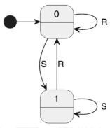
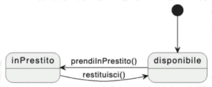

# noun extraction

parto da delle specifiche (tema esamo, user story, use case di uml, ...) prendo tutti i sostativi o le frasi sostantivizzate, si diche che bisogna perendere il set di richieste del cliente e spostarli in modo formale isolarli identificsre le cose, si può fare anche questo in modo incrementale.

Se è una spiegazione un po piu lunga (non la storia ma che unisce diverse sotrie) può avere saenso farlo incrementale.
Si considerano tutti i nomi e frasi sostantivizzati e poi si suano dei cirtieri per sfoltire un po.
Poi si ragiona sulle relazioni tra quetse classi, sui verbi, le azioni che si compiono, come interagiscono e collaborano. VERBI E SOSTANTIVI.

Meglio specifiche in inglese, non si fanno problemi a ripetere la stessa parola di continuo.

Esempio:
- **sostantivi**

The library contains books and journals. It may have several copies of a given book. Some of the books are for short term loans only. All other books may be borrowed by any library member of three weeks.
pezzo mancante

Non faccio di certo 12 classi, si riconoscono i nomi ma si sfoltiscono (non vuol dire buttare subito via, possiamo anche lasciarli in sospeso), con quali regole?

1. Ridondanza: sinonimi (nomi diversi per lo stesso concetto).
2. Vaghezza (nomi generici): oggetti, cose, ...
3. Nomi di eventi e oeprazioni (azione non un concetto che rimane) capire se ci sono informazioni legate
4. metalinguaggio (il sistema, le regole): qualcosa che cambia, se penso che sia una parte dinamica estraggo fuori. A maggior ragione se non c'è un regolamento fissato ma regole formali, molto piu mutevoli. Oggetti da configurare che verranno usati da altri.
5. esterno al sistema (libreria è cioò che voglio gestire non è dentro al sistema, settimana è unità di misura)
6. cose facilmente riconoscibili come attributi (Nome del membro dello staff)

Nessuna di queste regole sono automaticamente applicabili, bisogna ragionarci. Se eliminiamo rimangono 5 parole: book, copyofbook, library member, journal, staffmember.

Devo iniziare a capire come queste classi collaborano.

prima ipotesi facciamo associazioni, senza frecce perchè non so ancora se sono monodirezionali o bidirezionali.

Non è detto che io voglia realizzare una certa relazione mediante un attrivuto, poi si decide. Magari chiedo a un database.

In copyofbook metto informazioni specifiche (stato prestito, usura) ma non autore, descrizione, questo va in book e poi cito per risparmiare spazio.

Indichiamo cardinalità.

30+ minuti noiosi saltati da recuperare (solo esempio e domande)

# Stato

3 digaramma importante da sapere usare diagramma degli stati
classi = diagramma statico (struttura)
diagramma sequenza = proiezione evoluzione relatavi a funzionalità che coinvolge diversi componenti (trasformazioni e messaggi per svolgere compito)
stati ragiona sulla singola classe ma dinamicamene, come può evolvere in base agli stimoli esterni.

Lo stato può essere:
- concreto: dipende direttamente dai valori dei suoi attributi (dalla sua implementazione). La cardinalità dell'insieme degli stati possibili (**state space**) è enorme ed esplode molto facilmente (un solo intero ha $2^{32}$ stati, o circa $4 \times 10^{9}$, una Stringa ha troppi possibili stati). NOn è possibile pensare di fare un diagramma in cui mostrare tutti gli stati quando la numerosità è questa.
Ha una sua significatività, ma non possiamo pensare di comunicare qualcosa di sensato rappresentanto singolarmente tutti gli stati.
Lo stato è prodotto cartesiano degli attributi.

- Quando parliamo di diagramma degli stati parliamo di stati astratti e non concreti.
Sottoinsieme arbitrario degli stati concreti (considero tra di loro equivalenti una certa numerosità di stati). Piu stati concreti si sovrappongono ad uno stato astratto ma non viceversa. Bene scegliere qualcosa di significativo (riguarda la capacità di evolvere, diverse modalità di reazione agli stimoli, mi influenza il comportamento, se a stimolo reagisco in 20 modi diversi ha 20 stati diversi, se li metto in un unico stato posso farlo ma non mi dice nulla su cosa restituirà la prossima volta).

Casi particolari:
- oggetti senza stato (stateless object): le funzioni sono astrazioni funzionali che ragionano su dei parametri.
- oggetti con un solo stato (oggetti immutabili). Però pensare che le stringhe (immutabili) hanno piu stati è strano. Una **classe** immutabile ha più stati, sono le sue **istanze** che una volta create non posssono cambiarlo. Per estensione portiamo alla classe ma ???

Quando parliamo di diagrammi degli stati (state diagram) parliamo di oggetti che hanno uno stato (stateful) e che sono mutabili.

Sono una versione aggiornata e tarata sul design del software degli automi a stati finiti.

Un automa è una ennupla <$S$, $I$, $U$, $\delta$, $t$, $s_{0}$> in cui:
- $S$ è l'insieme finito e non vuoto degli stati
- $I$ è l'insieme finito dei possibili ingressi
- $U$ è l'insieme finito delle possibili uscite
- $\delta$ è la funzione di transizione, stabilisce i possibili passaggi da uno stato ad un altro. $\delta: S\times I \rightarrow S$. Dato uno stato e un input stabilisce qual'è il prossimo stato, può essere una funziona parziale (ovvero non essere definita per tutte le possibili coppie)
- $t$ è la funzione di uscita
- $s_{0}$ è lo stato iniziale, deve essere definito a priori. $s_{0} \in S$.

Esempio: flip flop set-reset.

S = {0, 1}
I = {R, S}
Transizioni = archi
funzione uscita: t: S -> U (l'uscita dipende esclusivamente dallo stato in cui mi trovo, automa di moore, automi di Mealy uscita dipende da stato corrente e come ci sono arrivato, uscita collegata agli archi e non ai nodi).
stato inizale = 0 (pallino nero).

In UML abbiamo che il diagramma degli stati è derivato da StateCharts un estensione degli automi a stati finiti base, viene usato per definrie comportamento di un oggetto (o meglio un digramma che deve valere per tutte le istanze di una classe, l'astrazione significativa comune). Esistono tool di reverse enegenering che dato codice ricavano un diagamma, se il sw è abbastanza intelligente da beccare un astrazione significativa e non banale, deve essere molto intelligente perchè sia comunicativo perchè bisogna astrarre da tutte le cose che non interessano ma lasciare tutte quelle interessanti. Fatto da un umano per spiegare certi fenomeni ad altri umani. Prof non crede nella parte di estrazione automatica. Può aver senso estrare un diagramma automatico se lo scopo è non farlo leggere a una persona ma darlo in pasto ad un altro tool. Diagramma stati serve come documentanzione, quindi no autogenerato.

Nell'esempio della biblioteca la copia di un libro è molto simile ad un flip flop.

Notiamo che non mi dice graficamente cosa succede se provo a prendere in prestito un libro già in prestito o restituire un libro che non è in presito, queto perchè in UML se non descrivo una freccia significa che non può accadere (se accade deve sollevare un eccezione), un po come se tutte le frecce che mancano vanno ad uno stato di errore.

Prendiamo i metodi pubblici della classe e diciamo che sono tutti candidati ad essere eventi che l'oggetto può subire. Non ho un ordine con cui vengono chiamati a priori. Magari operazione di inizializzazione e finche non l'ho fatta tutte le altre operazioni non sono ammesse.
Anche i metodi privati vanno tenuti in considerazione, possono essere chiamati da altre istanze della stessa classe.
Pubblici sicuro da mettere, privati non posso escluderli a priori, magari poi no.

Se volessimo modellare un registro di 32 bit? modelliamo tiriamo fuori diagramma enorme, se non siamo in grado di trovare astrazione semplice non è panacea il diagramma degli stati, se talmente legata ai stati concreti senza nulla di generalizzare non c'è modo di farlo con questo diagramma.

Nel nostro diagramma le azioni sono le uscite, faccio qualcosa verso l'esterno (chiamo il metodo di qualcun altro).

Etichettiamo archi con evento/azione oppure possiamo scriverle interne allo stato. entry=ogni volta che entro in questo stato accade questa cosa. Ci sono altri eventi particolari come exit, ...

Le guardie servono a disambiguare transazioni causate da uno stesso evento e uscenti da uno stesso stato.
Esempio: un libro diventa non disponibile quando l'ultima copia viene prestata, altrimenti rimane disponibile.

Ci sono anche altri eventi:
- temporizzati: dopo tot tempo che sono in un certo stato automaticamente passo ad un altro stato.
- change event: esprimo il trigger che fa cambiare stato non come è accaduto qualcosa ma ho raggiunto una certa configurazione di attributi interni, serve per:
1. fattorizzare il fatto che a seguito di diversi stimoli marco come non disponibile una certa cosa e triggero l'evento
2. connotare temporalmente la cosa, un azione può avere una certa durata e solo quando sono settati un certo numero di attributi parte un altra cosa.

# Superstato

Una cosa che non c'è negli automi base ma che viene ereditata da StateCharts è il concetto di superstato.

!img semaforo!

C'è una disomogeneita di astrazione tra i vari stati, se c'è spento mi asptto di trovare acceso invece ho gia le altre configurazioni. IN tutti e tre gli stati "accesi" se spento() vado a spento, sono in qualche modo simili.
Una macchina a stati finiti con superstati (o stati innestati) ci permette di creare delle gerarchie (piu o meno).

!img semaforo super!

Ad un primo livello ho solo due stati, acceso e spento, dentro acceso ho un altra macchina a stati finiti con uno stato iniziale, le sue transizioni ecc...
Fattorizzo spegni() in un unica freccia.
Si può anche fare che acceso() va ad acceso e "verde" ha il pallino nero dello stato iniziale.
Magari voglio interrompere (spegnere) ma quando riaccendo torno nello stesso stato di prima, questo è fattibile con lo stato di history (un pallino H all'interno).Prima volta quello iniziale poi riprende.

Gerarchizzare aumenta la potenza e la facilità espressiva, posso rendere opaco il superstato acceso quando non ho interesse ad entrare nei dettagli, ma trasparente e guardarci dentro quand voglio capire come funziona quella macchina in quel particolare stato.

Cosa che si può fare in piu che non viene usata spesso per indicare la singola classe ma o visto usare frequentemente per comporre diverse classi.
Invece che avere una singola macchina a stati finiti nel superstato ne posso avere piu di una separate in zone (regioni).

![Img]

Ho un sistema idle, quando attivo posso tornare idle, ma quando attivo torno idle (alto livello).
Se voglio dire cosa succede quando attivo bypasso il limite di un solo stato attivo alla volta delle fsm.
Ho 3, uno per ogni macchina, si va verso un sistema concorrente (parallelo) in cui appunto esprimo la concorrenza.
Produttore, consumatore e buffer per disaccoppiare le velocità di produzione e consumo.

Faccio partire:
Il produttore è pronto a produrre, se viene detto produci() è in fase di produzione e dopo 5 unità di tempo buffer.scrivi().

Il buffer ha 2 posizioni e quindi 3 stati possibili, se vuoto scrivo mezzo poi pieno e viceversa.

Se provo a scrivere quando pieno solleva un eccezione.

Consumatore analogo al produttore.

SI esce con stop() quindi blocca tutte e 3. Se avessero deglo stati finali si esce nel momento in cui tutte le macchine interne hanno finito di fare quello che dovevano fare.
Diversi modi per determinare fine, non si usano tanto.
Difficile che un oggetto sia internamente parallelo, saranno classi diverse ma volevo dare una visione d'insieme. L'azione di una diventa l'evento dell'altra. Due thread separati e un componente passivo.
Cosa che normalemne con un automa normale avrei dovuto fare il prodotto cartesiano degli stati (elencarli tutti, esplode facilmente), in questo modo si compone mantenendo tutta l'informazione ed è coinciso.

Se scrivo e il buffer è pieno non vorrei sollevare eccezione ma attendere, non fatto dal prof ma ci sono barre di sincornizzazione (quando chiamo scrivi va su una barra di sincronizzazione che si sincronizza con il fatto che c'è questa altra freccia, se una arriva prima l'altra aspetta).