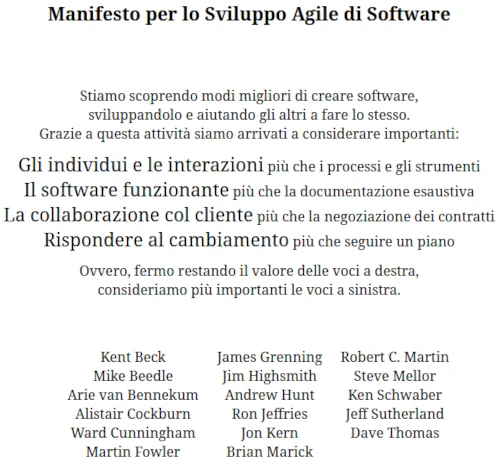
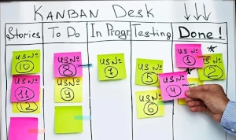

# **2. Modelli di ciclo di vita del software [[ST 2](../Slide%20teoria/02.pdf)] ([VL 3](https://www.youtube.com/watch?v=gZBZOOK67Y4) e [VL 4](https://www.youtube.com/watch?v=lLzVpWSOXC0))**

I modelli di ciclo di vita del software possono essere divisi in:
- *Prescrittivi*: danno istruzioni complete e precise per aderire ad una certa definizione di sviluppo del software.
- *Descrittivi*: più che spiegare come applicare il modello, cercano di descrivere ed evidenziare certi aspetti e caratteristiche dello sviluppo.

I seguenti modelli possono essere applicati anche ad una piccola parte del progetto, non è obbligatorio usarli per tutto. Team diversi possono lavorare usando modelli diversi e unendo i componenti si ottiene ugualmente un buon risultato.

## **2.1. Modello a cascata**

Il modello a cascata nasce alla fine degli anni '50, ma acquisisce notorietà solo negli anni '70. Questo modello in realtà racchiude al suo interno un insieme di altri modelli (che possono avere un numero di fasi differente) accomunati dalla **sequenzialità delle varie fasi**.

Caratteristiche:

- forza una **progressione lineare** da una fase alla succesiva.
- le varie fasi comunicano attraverso dei **semilavorati** (è un modello *document based*), questo permette una **separazione dei compiti** e di evitare fraintendimenti.
- si possono **pianificare i tempi** e **monitorare lo stato di avanzamento**.

In questo modello la manutenzione non è prevista, al massimo si possono fare delle piccole modifiche non documentate. Allora com'è possibile che nei progetti reali il 70% dei costi ricade proprio nella manutenzione?

Alcuni sostengono che la colpa è proprio del modello a cascata, congelando presto le specifiche sarà necessario effettuare molte correzioni nelle fasi successive.
Inoltre se viene richiesta una modifica che ha impatto sulla progettazione, questa diventa molto costosa.

Problemi:
- rigidità.
- congelamento dei sottoprodotti.
- dato che si punta ad un solo rilascio, non si tornerà mai dal cliente per farsi dare dei feedback. Le specifiche sono già state scritte, bisogna solo implementarle.
- la manutenzione viene fatta solo sul codice (disallineando il programma dalla documentazione).

### **2.1.1. Variante: modello a V**

In questa variante del modello a cascata, le fasi avvengono sempre in successione lineare ma si evidenziano meglio le relazioni tra le singole fasi e il testing, soprattuto si distingue tra **verifica** (*correttezza*, se ho fatto il sistema nel modo giusto) e **convalida** (*affidabilità*, se ho fatto il sistema giusto).

< img modello a v >

Nella maggior parte dei casi questo modello non è adatto perchè il vero problema è la volatilità dei requisiti.

### **2.1.2. Variante: con singola retroazione**

In questa variante è possibile tornare indietro di un passo in caso di errore. Se si è nell'ultima fase, si torna indietro un passo alla volta finchè non è possibile correggere l'errore, eventualmente anche arrivando fino alla prima fase.

Anche in questo modello la manutenzione non è prevista, però viene introdotto il concetto d'**iterazione**: è possibile eseguire dei cicli tra le varie fasi.

Nel modello a cascata normale, quando si termina una certa fase si può spostare il personale addetto su un altro progetto, in questo modello invece non è possibile perchè si potrebbe tornare indietro. La retroazione rende difficile stimare il tempo necessario per il completamento del progetto.

## **2.2. Modello a fontana**

Il modello a fontana è stato ideato da Henderson-Sellers nel 1993, anche in questo caso abbiamo una sequenza di fasi che però si possono interrompere per tornare alla prima.

Tornare alla prima fase non vuol dire ricominciare da zero, si vuole evidenziare il fatto che quando si trova un errore è necessario fare un po' di pulizia e chiedersi se la correzione effettuata ha conseguenze sulle fasi precedenti.

Bisogna notare che non c'è alcuna garanzia sul raggiungimento della fase corrente nell'iterazione successiva, correggendo un errore si potrebbero rompere altre cose che ci fanno fermare prima. Questo rende difficile capire a che punto si è arrivati e quanto ci vorrà per terminare il progetto.

A differenza dei modelli visti precedentemente, ci sono altre fasi dopo la consegna, si riconosce che pur essendo entrato in uso il programma è necessario fare manutenzione ed evoluzione.

L'inglobamento della consegna nel ciclo di vita del software può essere usato in due modi:
1. facendo manutenzione/evoluzione in casi eccezionali.
1. sviluppando il prodotto poco alla volta (il modello diventa **incrementale**): si realizza il minimo necessario per fare una prima consegna, poi si aggiungono progressivamente nuove funzionalità.

## **2.3. Modelli iterativi vs modelli incrementali**

Nei **modelli iterativi non incrementali** si raccolgono tutte le specifiche, si progetta l'intero sistema, lo si sviluppa iterativamente, si integrano tutti i componenti per ottenere il sistema finale ed infine lo si consegna.

Nei **modelli incrementali** invece l'iterazione viene estesa a tutte le fasi, anche alla raccolta dei requisiti. Questo porta a due possibilità:
- si raccolgono pochi requisiti, li si realizzano, si consegna e se ne chiedono altri.
- si raccolgono subito tutti i requisiti e si stabilisce un ordine di priorità in modo da realizzare prima quelli più importanti. Al termine di ogni consegna si permette al cliente di rinegoziare le richieste sia aggiungendo che togliendo funzionalità.

Integrare la variabilità delle richieste del cliente all'interno del processo di sviluppo lo rende più robusto rispetto a questo imprevisto.

In questa tipologia di modelli, la manutenzione come fase a se stante sparisce perchè viene integrata nell'iterazione successiva.

## **2.4. Modelli prototipali**

Nei modelli prototipali si realizzano dei **prototipi usa e getta** (throwaway) da mostrare al cliente per chiedergli pareri e conferme, se questi vengono validati li si butta via e si ricomincia lo sviluppo.

Questi prototipi sono realizzati senza dare importanza alle qualità del software (leggibilità, manutenibilità, estensibilità ed efficienza) in quanto vengono usati solo per verificare di aver compreso correttamente i requisiti. Questo approccio è molto usato per la creazione d'interfacce grafiche perchè esistono strumenti che permettono di generare velocemente dei modelli interattivi di prova.

Di contro, avendo realizzato un prototipo senza pensare a farlo bene, non si sà dire quanto sarà faticoso modificarlo per adattarlo a particolari esigenze del cliente che potrebbero sorgere in futuro. Si potrebbe introdurre un **debito tecnico** (più tempo lasciamo passare con qualcosa di brutto nel codice e più fatica dovremo fare per sistemarla).

I prototipi possono essere:
- **pubblici** o **esterni**: si mostrano al cliente per essere sicuri di aver capito correttamente i requisiti.
- **privati** o **interni**: servono agli sviluppatori per capire se una soluzione architetturale può andare bene (linguaggi, ...).

Un altra possibilità consiste nel realizzare il programma quasi completo per poi buttarlo via e ricominciare da capo (do it twice), questo perchè la progettazione viene considerata un **wicked problem** (sono quei problemi che si sanno risolvere bene solo dopo averci provato). Durante la prima realizzazione si capisce come affrontare i problemi che emergono, durante la seconda si realizza effettivamente un buon software.

    [L3] Boehm's Law: "Prototyping (significantly) reduces requirements and design errors, especially for user interfaces"

## **2.5. Problemi e svantaggi dei modelli incrementali**

Nei modelli incrementali il lavoro di pianificazione delle attività diventa più complicato, inoltre lo stato di avanzamento del progetto è meno visibile.

Bisogna sottolineare che l'approccio incrementale permette anche di *togliere* (buttare via del codice già scritto), potenzialmente si potrebbe continuare a scrivere e cancellare senza arrivare mai ad una versione finale. Se il cliente continua a pagare ci può anche star bene, ma in caso contrario è necessario chiedersi se convenga terminare il progetto.

Anche il riuscire ad estrapolare da un progetto complessivo le funzionalità da realizzare nella prima iterazione non è per niente banale (visione verticale delle funzionalità), si tende a metterci tutto.

Inoltre in alcuni modelli incrementali le iterazioni si possono sovrapporre (mentre si scrive il secondo incremento si stanno già raccogliendo i requisiti per il terzo), quindi il feedback dell'utente impiega molto tempo ad arrivare al programma.

### **2.5.1. Pinball cycle**

Il pinball cycle è una visione pessimistica ideata da Scott Ambler nel 1994. Questa sostiene che nella realtà non è possibile controllare l'ordine in cui verranno svolte le attività, si può indirizzare ma non controllare (come accade per l'appunto in un flipper). Questo rende impossibile imporre vincoli temporali e misurare lo stato di avanzamento.

## **2.6. Modelli trasformazionali**

In questa famiglia di modelli si cerca di controllare perfettamente tutto quello che accade in modo formale.

I requisiti vengono raccolti in modo informale, per poi venir progressivamente trasformati in specifiche formali. Applicando alle specifiche varie **trasformazioni** (la cui correttezza è certificata e dimostrabile a priori) si ottiene il prodotto. Se le specifiche sono corrette si ottiene il programma corretto.

Fasi del modello trasformazionale:
1. analisi e specifica dei requisiti.
2. conversione dei requisiti in specifiche formali e convalida delle stesse.
3. miglioramento della realizzazione (ottimizzazione). Ad ogni passo le specifiche verranno raffinate, specializzate ed ottimizzate, portando ad una nuova release più efficiente ma equivalente dal punto di vista delle specifiche.

In questo modello i componenti riusabili non sono solo software, anche le trasformazioni con le loro prove di correttezza si possono riutilizzare.

La storia dello sviluppo viene memorizzata perchè in caso di errori è possibile effettuare un *rollback*. In alternativa si può usare per creare un albero di diramazioni, ovvero una famiglia di prodotti che derivano tutti dalla stessa specifica ma che differiscono per specifiche ottimizzazioni (perchè pensati per macchine diverse).

## **2.7. Metamodello a spirale**

Il metamodello a spirale ideato da Boehm nel 1988 è un metamodello basato sui **rischi** (risk based), l'attenzione viene posta su quello che può andar male. Nei modelli precedenti nessuno ha pensato al fatto che nella realtà i progetti falliscono o possono essere interrotti.

< img modello spirale >

Ad ogni "giro" abbiamo un momento di decisione in cui si cerca di capire quali rischi si presenteranno in futuro, se è possibile superarli ed eventualmente a valutare le possibili alternative.

La spirale che si allarga sempre di più simboleggia l'aumentare del costo complessivo.

### **2.7.1. Modello a spirale win-win**

Questo modello mette in evidenza il fatto che il rapporto tra lo sviluppatore ed il cliente non è pacifico, si hanno obiettivi contrastanti. Gli sviluppatori vorrebbero essere pagati tanto per fare poco e il cliente vorrebbe pagare poco per avere tanto.

Ad ogni iterazione bisogna trovare un punto d'equilibrio (win-win) in cui entrambe le parti vincono o pensano d'aver vinto, altrimenti lo sviluppatore lavorerà male (perchè pagato poco) o il cliente non commissionerà ulteriori lavori (perchè costano troppo).

Questo contrasto tra le parti è una delle principali fonti di fallimento, senza considerare il fatto che anche il cliente può avere divergenze interne.

## **2.8. Modello COTS (Component Off The Shelf)**

Questo modello esaspera la riusabilità dei componenti, piuttosto che riscrivere cose già fatte le si prende dalla libreria e le si riusa.

Le attività previste in questo modello sono:
1. raccolta delle specifiche.
1. *component analysis*: si cercano internamente o nel mercato dei componenti gratuiti o a pagamento che pottebbero essere utili per soddisfare i requisiti del cliente (component query e component retrival). Probabilmente si troveranno diversi componenti che fanno più o meno la stessa cosa.
1. se non sono stati trovati dei componenti adatti si propone al cliente di modificare le sue richieste per poter sfruttare i componenti trovati (requirements modification). Se accetta si può proseguire con lo sviluppo, in caso contrario è necessario effettuare delle modifiche, e questo ha un costo. Se il cliente non è disposto a pagare di più non è possibile utilizzare il componente considerato.
1. dopo aver recuperato i vari componenti si progetta il sistema, in questa fase si decidono quali **adattatori** (adapter) vanno realizzati per far dialogare i vari componenti riutilizzati che sono incompatibili tra loro (possono essere cose banali come il cambiare l'ordine dei parametri di una funzione).
1. si sviluppano i componenti mancanti e gli adattatori, si integrano e si ottiene il prodotto.

## **2.9. Metodologie agili**

La metodologie agili raggruppano varie idee accomunate dal fatto di essere nate dal basso (da sviluppatori e consulenti insoddisfatti dei modelli utlizzati precedentemente). Diverse persone si sono ritrovate a fare ragionamenti simili, così un giorno si sono riunite e hanno pubblicato il seguente manifesto:

Uno degli aspetti più significativi è la collaborazione con il cliente, si vuole evitare un rapporto conflittuale. Per fare questo si cambia la modalità del pagamento, invece che farsi pagare per il programma si viene pagati per il tempo impiegato. Dando modo al cliente di verificare come è stato speso il tempo si garantisce che lo sviluppatore lavorerà al massimo delle sue capacità.

### **2.9.1. Lean software**

Il lean software nasce dal lean manufactoring della Toyota.

Il concetto principale è la riduzione gli sprechi (reduce waste): durante lo sviluppo vengono generati diversi sottoprodotti che il cliente non vuole e che non vedrà mai, non realizzandoli si risparmia.

Un altro concetto molto importante è il prendere le decisioni il più tardi possibile, in questo modo si è più sicuri di aver fatto una buona scelta.

Si parla anche di cose più filosofiche e motivazionali come la responsabilizzazione del team.

### **2.9.2. Kanban**

Il kanban prevede una minimizzazione del lavoro in corso (work in progress).

Si crea una tabella con diverse colonne contenenti dei foglietti (funzionalità da sviluppare), ognuna di queste rappresenta uno stato di avanzamento. In genere si divide in:

- Storie (backlog): contiene le funzionalità richieste.
- Da fare: contiene le funzionalità da realizzare nella prossima iterazione.
- In corso: contiene le funzionalità che stanno venendo realizzate al momento, ci può essere al massimo un foglietto a persona (o coppia nel pair programming). Se uno sviluppatore è bloccato in attesa di altri, non inizia a sviluppare una nuova funzionalità, ma sollecita o aiuta i colleghi a terminare la loro in modo da continuare velocemente sulla propria.
- Testing: contiene le funzionalità finite che stanno venendo testate.
- Finite: contiene le funzionalità realizzate e testate con successo.

Il kanban è un modello molto semplice da attuare, inoltre permette di avere un idea dello stato di avanzamento con un semplice colpo d'occhio.

### **2.9.3. Scrum** 

Il principio più importante di questo modello è il congelamento delle richieste del cliente per un certo periodo di tempo (generalmente 15 giorni). In questo modo gli sviluppatori avranno un po' di tempo per poter lavorare senza dover pensare ai cambiamenti. Diventa però necessario fare iterazioni corte (2-4 settimane).

### **2.9.4. Crystal**

Il punto principale di questo modello è la **comunicazione osmotica** (presente anche il molti altri modelli): in un team non dovrebbe esserci un singolo depositario di una certa conoscenza, si vuole creare un senso di proprietà e responsabilità collettiva.

Questo permette ti avere meno problemi nel caso in cui una persona stia male o venga licenziata, non ci si blocca perchè era l'unico a saper fare una certa cosa, chiunque può sostituirlo. Inoltre se uno sviluppatore deve mettere mano a cose che non ha fatto lui, avrà comunque un idea generale del funzionamento e potrà lavorarci senza chiedere aiuto ad altri.

Il **pair programming** è una possibile applicazione di quest'idea, permette di lavorare su codice nuovo se affiancati da qualcuno che lo conosce già. Cambiando continuamente le coppie si finisce per imparare tutto.

Questo modello funziona bene solo per team piccoli (8-10 persone), in team molto grossi non può essere applicato. Esistono altri modelli agili che cercano di migliorare lo sviluppo in team molto numerosi.

---

Torna all'[indice degli argomenti](../README.md#indice-degli-argomenti)  
Capitolo successivo: [eXtreme Programming (XP)](3%20Extreme%20programming.md)  
Capitolo precedente: [Introduzione al corso](1%20Introduzione%20al%20corso.md)