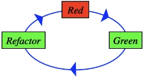

# **3. eXtreme Programming (XP) [[ST 3](../Slide%20teoria/03.pdf) e [ST 4](../Slide%20teoria/04.pdf)] ([VL 5](https://www.youtube.com/watch?v=_RzzYR6zyOQ), [VL 6](https://www.youtube.com/watch?v=RnGVCqWcFqA) e [VL 7](https://www.youtube.com/watch?v=ALdCaAboxSQ))**

## **3.1. Origini e variabili in gioco**

XP nasce alla fine degli anni '90 - inizio 2000, quando l'autore principale, Kent Beck, stava lavorando al rifacimento del sistema di contabilità della Chrysler. In questo periodo ragionò sulle differenze tra quello che gli era stato insegnato ad ingegneria del software e la sua esperienza di lavoro.

Inizialmente cercò di definire quali sono le variabili coinvolte nello sviluppo del software, identificando le seguenti:
- **portata**: la quantità di funzionalità da mettere nel programma.
- **tempo**: il tempo che si può dedicare allo sviluppo del progetto.
- **qualità**: tutte le qualità viste precedentemente (correttezza, affidabilità, ...).
- **costo**: il prezzo che si dev'essere disposti a pagare.

Successivamente realizzò che queste quattro dimensioni non sono indipendenti, ma anche che non è possibile calcolarne una a partire dalle altre.

In XP si vuole ottenere software di *qualità*, quindi questa dimensione non è negoziabile, bisogna giocare sulle altre. Quelle su cui si può farlo maggiormente sono il *costo* e il *tempo*. Dato che in XP gli sviluppatori vengono pagati a tempo, è possibile calcolare la portata partendo dalle altre variabili.

Grazie all'uso della metodologia incrementale (*increment then simplify*), anche se il cliente decide d'interrompere il progetto si ritoverà comunque con un prodotto (incompleto) in mano. Questo prodotto **è il meglio che si poteva fare con quei soldi e quel tempo**.

## **3.2. Test driven development (TDD)**

Il TDD non è un attività di verifica o di programmazione, ma una metodologia di progettazione che guida verso la soluzione più semplice che risolva un problema. In genere il software semplice ha anche molte delle altre qualità che ricerchiamo.

### **3.2.1. Applicazione del TDD**

Quando si deve aggiungere una nuova funzionalità al programma si procede nel seguente modo:
1. **Rosso**: si scrive un test che andrà a controllare la correttezza della funzionalità da implementare (*test first*), inizialmente questo test fallirà perchè la funzionalità testata non è ancora presente.
1. **Verde**: si cerca di far passare il test appena scritto con la soluzione più semplice possibile, in questa fase è accettabile copia incollare altri frammenti di codice.
1. **Refactoring**: prima di scrivere il test successivo è necessario effettuare il refactoring, questa attività consiste nel migliorare il codice senza far fallire i test scritti precedentemente.

Queste tre fasi vanno ripetute ogni 2-10 minuti (*baby steps*) fino alla completa implementazione della funzionalità.

La complessità della funzionalità da realizzare varia con l'abilità del programmatore (è quello che riesce a fare in 10 minuti), inizialmente saranno cose semplici e con l'esperienza si riusciranno a realizzare cose sempre più complesse.

### **3.2.2. Vantaggi offerti dal TDD**

Eseguire subito i test permette di capire velocemente se la soluzione scritta è sensata, se non si riesce a far passare il test in 10 minuti probabilmente l'approccio scelto non è quello giusto, è meglio ricominciare da capo. Eseguire i test solo alla fine potrebbe far perdere molto più tempo.

Negli editor e IDE moderni, scrivere prima i test di offre il vantaggio di poter generare automaticamente alcune porzioni di codice facendo risparmiare tempo.

Spesso quando si scrive un programma che verrà usato da altre persone ci si pone solo dal lato dello sviluppatore, non pensando a cosa è comodo e utile per il cliente. Scrivendo i test siamo sicuri che stiamo facendo esattamente quello che ci viene richiesto.

Questa metodologia dà la sicurezza di ottenere un programma facilmente testabile, siamo sicuri che non ci saranno ostacoli difficilmente rimovibili.

Se effettuato correttamente il TDD garantisce la *copertura dei comandi*, se delle righe di codice non sono coperte dai test si possono togliere, non fanno parte della soluzione più semplice possibile.

## **3.3. Confronto tra principi**

### **3.3.1. I principi di XP**

XP s'ispira ad alcuni principi basilari:

- **feedback rapido**: bisogna applicare varie pratiche legate all'efficienza di comunicazione sia tra il team che con il cliente. All'inizio di ogni giornata si tiene una riunione di 5-10 minuti in cui tutti stanno in piedi (*stand up meeting*), a turno ogni sviluppatore dice brevemente cosa ha fatto ieri e cosa farà oggi. In questo modo si evita che più persone lavorino alla stessa funzionalità e si aggiornano velocemente altri membri del team sul progresso dello sviluppo di funzionalità attese.
- **presumere la semplicità**: non serve pianificare per il futuro, è meglio concentrarsi su quello che serve in questo momento. Scrivere codice pensando anche alle funzionalità future è pericoloso perchè se cambiano le richieste (e probabilmente cambieranno) bisogna effettuare grosse modifiche.
- **accettare il cambiamento**: s'inizia a dare per scontato che il cliente possa chiedere frequentemente di cambiare le sue richieste (grande differenza con l'ingegneria del software classica). Sorge la necessità di usare un modello di sviluppo che abbia un elevata capacità di adattamento ai cambiamenti.
- **modifica incrementale**: bisogna procedere compiendo piccoli passi, sia nella progettazione che anche anche in altri aspetti. Ad esempio non bisogna mai aggiungere al team più di una persona alla volta, altrimenti si dedicherebbe la maggior parte del tempo a istruire i nuovi arrivati piuttosto che a sviluppare software.
- **lavoro di qualità**: bisogna fare in modo che gli sviluppatori si trovino bene lavorando nell'azienda, la loro fidelizzazione all'azienda è importante. Quando uno sviluppatore si licenzia, l'azienda perde know-how e recuperarlo non è semplice.

### **3.3.2. I principi dell'ingegneria del software classica**

Nell'ingegneria del software classica ci sono sia principi simili che contrapposti a quelli di XP:
- **separazione degli interessi** (*aspects* o *concern*): bisogna separare le dimensioni con cui si può affrontare il problema (tempi, responsabilità, moduli, funzionalità, componenti, ...).
- **astrazione e modularità**: l'astrazione permette di dominare i problemi complessi anche se va usata con coscienza.
- **anticipazione del cambiamento** (*design for change*): durante la progettazione bisogna tenere conto di quello che potrebbe essere richiesto in futuro. Non è un approccio sbagliato, però gli informatici sono molto fantasiosi e spesso s'inventano dei requisiti che il cliente non si sogna neanche lontanamente, complicandosi inutilmente la progettazione e lo sviluppo.
- **generalità**.
- **incrementalità**.
- **rigore e formalità**.

### **3.3.3. Presumere la semplicità vs anticipare il cambiamento**

Nel 1976 Boehm *ipotizzò* una curva esponenziale per il costo delle modifiche basandosi su uno studio di casi "reali" (pochi progetti dei laureandi).

In XP si ritiene che questo non sia (o non sia più) vero, se si lavora in modo rigoroso, sfruttando le ultime scoperte, usando linguaggi di alto livello e i nuovi tool di supporto la curva che si ottiene è logaritmica.

Assumendo che questa sia la curva corretta, il design for change non ha più senso, anche se si rimandano le modifiche non immediatamente necessarie il costo di modifica non salirà di molto.

In realtà questi due modi di pensare non sono in contrapposizione: Boehm parlava specificatamente di bug fix, mentre in XP si parla di raccolta dei requisiti e di progettazione incrementale. In letteratura sono stati riuniti e confrontati, ma non è detto che siano entrambi sotto la stessa legge.

## **3.4. Figure in gioco e responsabilità**

Fondamentalmente ci sono 3 figure di cui si tiene conto:

- il **cliente**: colui che commissiona il lavoro e che conosce il dominio applicativo.
- il **manager** (del cliente): colui che prende le decisioni economiche.
- lo **sviluppatore**: colui che scrive il codice e la documentazione tecnica.

Il cliente e/o il suo manager ha:
- la responsabilità di decidere:
    - la portata del progetto.
    - la priorità delle varie funzionalità.
    - le date dei rilasci.
- il diritto di:
    - sapere cosa può essere fatto, con quali tempi e a quali costi.
    - vedere progressi nel sistema, provati dal superamento di test da lui definiti (essenziale per la fiducia).
    - cambiare idea, sostituire funzionalità e cambiare priorità.

Lo sviluppatore ha:
- la responsabilità di decidere:
    - le stime dei tempi per le singole funzionalità.
    - le conseguenze di scelte tecnologiche.
    - una pianificazione dettagliata.
- il diritto di:
    - sapere cosa è necessario attraverso dei requisiti chiari (casi d'uso) con priorità.
    - cambiare le stime dei tempi con l'aumentare dell'esperienza sul progetto (non perchè si ha sbagliato ma perchè è cambiato il contesto).
    - identificare e indicare le funzionalità pericolose.
    - produrre software di qualità senza essere costantemente stressato e sotto pressione.

## **3.5. L'approccio pratico**

XP fornisce 12 pratiche da applicare concretamente al fine di ottenere un prodotto di qualità. Ogni pratica ha sia dei lati positivi che dei lati negativi, però usandole tutte assieme si bilanciano, complessivamente i vantaggi superano gli svantaggi.

### **3.5.1. Planning game**

Il **planning game** è un meeting giocoso svolto all'inizio di una nuova iterazione in cui si decide quali saranno le prossime funzionalità da realizzare (si congelano i requisiti per tutta la durata dell'iterazione).

Le richieste del cliente vengono formulate tramite delle piccole carte su cui il cliente ha il compito di scrivere:
- l'identificativo della carta.
- una **user story**, ovvero una frase scritta in linguaggio informale con cui si spiega brevemente il funzionamento di una certa funzionalità.
- un **test d'accettazione**, può essere un esempio, il cliente lo controllerà per assicurarsi che è stato fatto.
- il **valore** (ovvero la **priorità**) che quella funzionalità ha per lui.

Il team di sviluppo invece ha il compito di scrivere la **stima del tempo** necessario a realizzarare tale funzionalità, questa stima può cambiare nel corso dello sviluppo. Normalmente questo è il compito dell'analista, ma in XP è l'intero team ad occuparsene.

Durante l'iterazione, uno degli sviluppatori assume anche il ruolo di **tracker**. Questa figura ha il compito di tracciare diverse misure (tempo dedicato ad ogni funzionalità, numero di funzionalità sviluppate, numero di test che passano, numero di bug segnalati, ...) e di renderle visibili a tutto il team tramite cartelloni o lavagne.

A questo punto bisogna decidere quali funzionalità sviluppare nella prossima iterazione. Per fare ciò si ordinano le carte in base al risultato ottenuto calcolando valore/tempo e si riempie il tempo a disposizione con quelle più importanti, cercando di non creare funzionalità scollegate tra loro.

Dato che le stime del tempo non sono realizzate da una singola persona ma dall'intero team queste potrebbero:
- superare le 2 settimane: è necessario dividere la funzionalità in più parti.
- essere molto diverse: probabilmente la funzionalità non era molto chiara, va riformulata cercando di chiarirla.
- differire per poco: in questo caso bisogna raggiungere un accordo, in XP è fondamentale raggiungere l'unanimità, tutte le persone del team devono riconoscersi nella stima accettata.

Quando si cerca di mettere d'accordo più persone sorgono due problemi:
- si **perde molto tempo**: mentre si parla e ci si convince a vicenda non si sviluppa software.
- si soffre dell'**effetto ancoraggio** (*anchoring effect*): è un **bias cognitivo**, il primo sviluppatore a comunicare la sua stima imposta l'ancora, di conseguena tutte le stime successive saranno influenzate dalla prima e non gli si discosteranno di molto. Gli esprimenti scientifici psicologici hanno dimostrato che l'effetto di questo bias non è influenzato dal rispetto e dalla fiduicia che si ripone nella persona che fa la prima stima.

### **3.5.1.1 Stime agili**

Sono state create due metodologie che permettono di trovare un accordo riducendo al minimo la comunicazione ed evitando l'effetto ancoraggio:

### **3.5.1.2. Planning poker**

Ogni sviluppatore ha un proprio mazzo di carte numerate in modo non lineare (esponenziale, potenze di 2, serie di fobonacci, ...), questo perchè si vogliono rappresentare diversi ordini di grandezza. Il mazzo contiene anche alcune carte particolari: "?" significa che non si ha idea di quanto tempo ci voglia e "☕" è una proposta di coffee break.

Il cliente (o chi ne fa le veci) presenta brevemente le carte contenenti le user stories, in questo momento il team può fare domande per avere chiarimenti ma non può fare alcun riferimento alle possibili stime per evitare l'effetto ancoraggio.

Ogni sviluppatore sceglie dal proprio mazzo una carta, dopo che tutti hanno scelto le si mostra contemporaneamente. Se la stima di tutti coincide si prosegue con il valutare la prossima carta, altrimenti le due persone che hanno fatto la stima più alta e quella più bassa hanno 30 secondi - 1 minuto a testa per motivare la loro scelta, dopodichè tutto il team rivota. Questo processo va avanti finchè non si raggiunge l'unanimità, generalmente bastano 2 votazioni.

Per tradurre i numeri delle carte in tempo reale si valuta il tempo richiesto dal task meno impegnativo, tutti gli altri si calcolano in proporzione.

### **3.5.1.3. Team estimation game**

Questo metodo risolve il problema della comunicazione eccessiva limitando nel tempo le argomentazioni. L'effetto ancoraggio è presente ma ha un impatto minore (ordinamento relativo e non assoluto), inoltre se il team è composto da N sviluppatori ognuno di essi creerà l'ancora per 1/N carte. A differenza del planning poker questo metodo permette di riconsiderare le stime precedenti.

**Prima fase**

Si mette il mazzo delle carte contenenti le user stories sul tavolo e gli sviluppatori si mettono in fila. La prima carta viene posizionata sul tavolo, poi il primo sviluppatore prende un'altra carta, la legge ad alta voce e la posiziona nel posto che ritiene più opportuno, infine si sposta in fondo alla coda.

Lo sviluppatore successivo può:
- prendere una nuova carta, leggerla e posizionarla (può anche metterla in mezzo ad altre carte creando una nuova colonna).
- cambiare la posizione di una carta già posizionata precedentemente, questo può avvenire solo dopo aver spiegato brevemente la motivazione ad alta voce.

Anche in questo caso potrebbero essrci discussioni ma dopo un paio di giri l'ordinamento viene accettato da tutti. A questo punto sul tavolo saranno presenti tutte le carte ordinate relativamente per difficoltà.

**Seconda fase**

Si cercano di quantificare le distanze tra le carte, per fare ciò si prende un singolo mazzo di carte del planning poker e si assegna un valore alla carta meno impegnativa. In genere non gli si assegna mai il valore più basso perchè nelle iterazioni successive potrebbero comparire task più facili.

A turno ogni sviluppatore può posizionare un valore o spostare uno di quelli già presenti (anche creando colonne vuote), motivando la sua decisione.

Per tradurre i numeri delle carte in tempo reale si può usare lo stesso procedimento del planning poker. Ma è davvero necessario farlo? Nella pratica si è visto che questo sforzo ulteriore non è così produttivo, anche perchè nel tempo queste valutazioni cambiano.

### **3.5.2. Brevi cicli di rilascio**

I rilasci devono introdurre modifiche significative e generalmente avvengono ogni 2 settimane. Questo permette agli sviluppatori di lavorare senza avere la preoccupazione del cambio di specifiche e al cliente di cambiare le richieste e le priorità abbastanza spesso.

### **3.5.3. Uso di una metafora**

Si cerca di trovare una metafora con cui ragionare con il cliente. L'uso di una metafora e di un linguaggio non tecnico (*dizionario comune*) permette di comunicare bidirezionalmente senza usare sinonimi, eliminando quindi ogni abiguità.

### **3.5.4. Semplicità di progetto**

Si cerca di massimizzare il lavoro non fatto, bisogna fare solo quello che serve, senza duplicazioni (*one and once only*) e nel modo più semplice possibile (*KISS, Keep It Simple Stupid*).

### **3.5.5. Testing**

I clienti scrivono i test funzionali affinchè possano avere fiducia nel programma, i programmatori invece scrivono i test d'unità affinchè la fiducia nel codice diventi parte del programma stesso. I test consentono agli sviluppatori di accorgersi tempestivamente degli errori, ed eventualmente di effettuare un rollback.

Anche quando bisogna lavorare su un sistema legacy che non è stato sviluppato con metodologie agili (realizzato da altri sviluppatori nel passato che non hanno scritto test) si procede alla solita maniera. Prima si scrivono i test che vanno a controllare la correttezza della funzionalità che si vuole modificare, poi si può mettere mano al codice.

### **3.5.6. Refactoring**

Il **refactoring** consiste nel modificare il codice per migliorarne le qualità interne e ridurne la complessità senza cambiare le funzionalità.

### **3.5.7. Programmazione a coppie (pair programming)**

Vantaggi offerti dalla programmazione a coppie:
- ci si controlla a vicenda, non ci si distrae e si rispettano le regole.
- la seconda persona è fondamentale per fare refactoring. Chi scrive si concentra sulla risoluzione del problema che si trova davanti in quel momento, mentre il compagno può concentrarsi su una visione più generale, iniziando a pensare come migliorare il codice che sta venendo scritto. Dopo un certo tempo ci si scambia di ruolo.
- proprietà collettiva (*comunicazione osmotica*): programmando con altre persone ci si trasferisce conoscenza a vicenda.

Spesso quando uno stagista entra nel team lo si lascia isolato per una settimana a leggere documentazione senza la possibilità di far domande agli sviluppatori più esperti per non fargli perdere tempo. Nella programmazione a coppie invece anche la figura junior viene valorizzata, spesso quando gli spiegano alcune cose ci si rende conto della presenza di errori e di possibili miglioramenti. Essere costretti a dialogare ed esporre le motivazione delle scelte è molto utile.

Gli studi hanno dismostrato che la produttività giornaliera di una coppia è pari al 150% della produttività del singolo sviluppatore. Questo potrebbe far pensare che non sia un buon approccio, però se si considera un arco temporale maggiore si scopre che la coppia diventa più produttiva perchè trascorre meno tempo a revisionare e sistemare il codice che ha scritto.

### **3.5.8. Proprietà collettiva**

Spesso i programmatori vorrebbero modificare il codice scritto da altri per migliorarlo, però proprio perchè è di altri non ci si sente autorizzati a metterci mano o non gli si da importanza (non è una propria responsabilità). In XP il codice è di proprietà dell'intero team, qualsiasi sviluppatore ha il diritto di modificare qualunque parte del codice se lo ritiene opportuno. Grazie ai test si è sicuri di non rompere niente, al massimo si effettua un rollback e si ritorna alla situazione iniziale.

### **3.5.9. Integrazione continua**

In XP l'integrazione è cosi frequente che non la si considera più una fase a se stante, viene integrata nello sviluppo del componente. Ogni volta che si sviluppa una funzionalità bisogna anche integrarla nella **macchina d'integrazione** (una macchina dedicata all'integrazione di tutti i contributi delle coppie). L'accesso a questa macchina è esclusivo, quindi se non si riesce ad effettuare l'integrazione velocemente bisogna rinunciare. In questo caso si cercano di risolvere i problemi emersi sulla macchina locale della coppia per poi riprovare ad integrare più tardi.

Integrare un componente alla volta permette di capire velocemente qual'è la causa di un problema quando se ne manifesta uno (avendo aggiunto un solo componente sarà un problema legato a quest'ultimo). Molto spesso i componenti superano perfettamente i test d'unità, ma quando vengono integrati possono sorgere diversi problemi.

L'integrazione è un grosso problema nel modello a cascata, in genere si sottostima il tempo necessario a svolgerla. Storicamente questa operazione è sempre stata pesante e complicata, motivo per cui i continui fallimenti hanno preso il nome di *merge hell* o *integration hell*.

In XP l'integrazione è più semplice proprio perchè si fa molto spesso. Integrando subito il componente appena sviluppato, la situazione della macchina d'integrazione sarà molto simile a quella della macchina locale usata dalla coppia, probabilmente sorgeranno meno problemi.

### **3.5.10. Settimana di 40 ore**

XP impone un limite massimo di 40 ore di lavoro a settimana, questo per diversi motivi:
- lo sviluppo di software è un mestiere faticoso per il cervello e un cervello stanco non lavora bene. Si preferisce lavorare meno un giorno per essere poi più produttivi il successivo. Ci possono essere dei periodi in cui si cerca di avere un picco di produttività, ma questo ritmo di lavoro **non è sostenibile**.
- maggior soddisfazione del team.
- trascorrendo più tempo a casa ci sono meno problemi familiari.
- si fidelizzano gli sviluppatori verso l'azienda, avendo così una minor probabilità di perdere dipendenti e knowhow.

### **3.5.11. Cliente sul posto**

Avere un membro dell'azienda cliente sul posto di lavoro è molto importante, non solo per dimostrargli che si sta lavorando per lui, ma anche per potergli porre delle domande e fargli fare dei test. Le user story delle carte sono brevi frasi informali e potrebbero non essere sufficienti ad avere un idea chiara della richiesta.

Questa persona entra effettivamente a far parte del team di sviluppo: anche se può lavorare per la sua azienda da remoto, la sua priorità è quella di rispondere alle domande degli sviluppatori. Il contatto continuo con gli sviluppatori permette e facilita la generazione di nuove idee, molte user stories vengono scritte proprio durante un iterazione.

Uno dei problemi di questo approccio è la presenza di diversi stakeholders con interessi e priorità diverse. Questa persona dev'essere abbastanza brava da riuscire a coprire le competenze di tutti e comprendere il sistema nel suo complesso.

Nel caso in cui non sia possibile avere una membro dell'azienda cliente sul posto, uno degli sviluppatori dovrà studiare le richieste ed impersonare il cliente. Sarà l'unica persona a cui è consentito rispondere alle domande degli altri sviluppatori ed eventualmente ad interfacciarsi direttamente con il cliente.

### **3.5.12. Standard di codifica**

Per poter comprendere più facilmente il codice scritto da altri membri del team bisogna creare delle regole di scrittura che vengano rispettate da tutti (nomi delle variabili, posizionamento parentesi, massimo livello d'indentazione, ...). Esistono diversi strumenti che permettono di controllare automaticamente il rispetto di tali regole, ed eventualmente anche applicare correzioni quando non vengono rispettate.

## **3.6. Velocity**

Dalla seconda iterazione in poi è possibile calcolare la **velocity** del team, questo valore misura la quantità di lavoro svolto durante l'ultima iterazione (viene osservato a posteriori).

La velocity serve al team stesso per avere un idea dei loro progressi, dei loro punti di forza e di come possono migliorare. Non dev'essere usata per dare premi o punizioni, per fare confronti tra team diversi (ogni team ha il proprio metro di misura per la dimensione dei task) e soprattuto **non dev'essere imposta**.

Se si toglie uno sviluppatore dal team la velocity diminuirà, ma se ne si aggiunge uno potrebbe non aumentare o addirittura diminuire. Questo accade perchè parte del tempo viene dedicata alla formazione del nuovo arrivato. La cosa peggiore che si può fare quando un progetto è in ritardo è aggiungere altre persone al team di sviluppo.

## **3.7. Documentazione**

In XP si preferisce avere un software funzionante piuttosto che una buona documentazione, infatti spesso non la si realizza neanche.

In realtà però non è completamente assente, la documentazione è contenuta nel codice, nel cliente e nel compagno di coppia. Questo avviene perchè:
- si sono scritti i test di unità: sono a tutti gli effetti delle specifiche operative (eseguibili), infatti vengono realizzati prima del codice.
- il refactoring porta ad avere un codice facilmente leggibile e comprensibile. Se si sente il bisogno di scrivere un commento significa che il codice non è abbastanza chiaro, bisogna riscriverlo meglio. Scrivere codice semplice è la cosa più difficile che ci sia.

## **3.8. Quando non si può usare XP**

XP non si può usare se:
- l'ambiente proibisce anche solo 1 dei 12 punti.
- ci sono barriere manageriali (elevata gerarchizzazione, servono piccoli team indipendenti).
- il software va eseguito su una macchina particolare disponibile solo in determinati slot di tempo (supercomputer).
- ci sono troppi stakeholders complessi in contrasto tra di loro.
- non ha senso usare il sistema incrementale, è *necessario* avere tutto subito (centrale nucleare).

## **3.9. Alcune critiche**

Secondo diversi sviluppatori in XP:
- si sottovaluta eccessivamente l'importanza della comprensione iniziale delle richieste.
- si sopravvalutano eccessivamente le user stories, è troppo complicato riuscire a capire il funzionamento generale di una funzionalità partendo esclusivamente dal caso specifico scritto sulla carta.
- non si evidenziano sufficientemente le dipendenze tra le user stories.
- si può avere visione tropo ristretta causata dal TDD.
- non si tiene conto che nella realtà i team sono molto disomogenei (si hanno compentenze molto verticali).

## **3.10. XP 2.0**

In XP 2.0 è stata introdotta una tredicesima regola (just rules) per dare più libertà ai team e rendere meno prescrittivo l'approccio di XP. Questa scelta però ha sollevato diverse critiche.

Secondo XP 2.0 se una certa regola non funziona per com'è strutturato il team al momento, si può provare a sospenderla per 1-2 iterazioni, poi se tutto il team è d'accordo la si può togliere. L'uso di XP è una cosa che si apprende lentamente, non si può imparare a rispettare tutte le pratiche in un solo giorno.

---

Torna all'[indice degli argomenti](../README.md#indice-degli-argomenti)  
Capitolo successivo: [Open source process](4%20Open%20source%20process.md)  
Capitolo precedente: [Modelli di ciclo di vita del software](2%20Modelli%20di%20ciclo%20di%20vita%20del%20software.md)