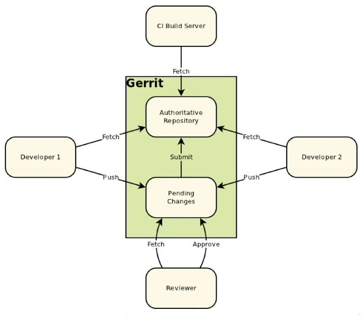

# **6. Git<br>[[ST 5](../Slide%20teoria/05.pdf?page=16) e [ST 6](../Slide%20teoria/06.pdf)] ([VL 10](https://www.youtube.com/watch?v=IWfVQQmzFX4), [VL 11](https://www.youtube.com/watch?v=emxwbTkEY2E) e [VL 12](https://www.youtube.com/watch?v=qe90rorNQuQ))**

## **6.1. Introduzione a Git**

Git è uno strumento di SCM realizzato da Linus Torvalds nel 2005 a seguito della sua insoddiafazione per gli altri strumenti gratuiti disponibili all'epoca, dopo poco tempo il manutentore principale è diventato Junio Hamano. Git è nato per facilitare lo sviluppo del kernel Linux (rendendolo più veloce ed efficiente), ma nel tempo ha conquistato la maggior parte del mercato (93.9% nel 2022).

Dato che Torvalds è un esperto di sistemi operativi, ha creato Git rendendolo molto simile ad un filesystem. Quando si vuole registrare una nuova versione, Git non salva il delta come gli altri strumenti di SCM, ma salva una copia dei file modificati. Nel caso in cui un file non sia stato modificato viene creato un collegamento che punta a quello già esistente per non duplicarlo. Questo vale solo a livello astratto, nella pratica il suo funzionamento è più complicato.

Git è pericoloso perchè, a differenza di altri strumenti simili, permette di cancellare e riscrivere la storia a piacimento. Questa capacità è però fondamentale, quando si vuole pubblicare un contributo ad un progetto open source si vogliono nascondere gli errori che si sono commessi durante lo sviluppo, sia per vergogna che per rendere più facilmente comprensibili le modifiche effettuate.

## **6.2. Aree di lavoro**


Per lavorare con Git bisogna utilizzare e attraversare diverse aree di lavoro:

- **Repository remoto**: contiene l'intera storia del progetto, si può sincronizzare con diversi altri repository. Spesso questi repository non hanno l'index, il working space e lo stash, per questo motivo sono anche chiamati **bare repo**.
- **Repository locale**: copia locale del repository remoto, le modifiche effettuate localmente vengono salvate qui prima di essere trasmesse al repository remoto.
- **Index** (o **stage**): area in cui vengono salvati i file modificati prima di confermare la creazione di una nuova versione. Quest'area è una peculariatà di Git, gli alti strumenti di SCM non ce l'hanno.
- **Working space** (o **working directory**): area che contiene i file su cui si sta lavorando attualmente.
- **Stash**: area in cui vengono memorizzate temporaneamente le modifiche effettuate nel working space, in modo da poter iniziare a lavorare partendo da un altra versione senza rischiare di perderle.

## **6.3. Comandi di Git**

Essendo nato per funzionare da riga di comando, tutti i comandi di Git sono richiamabili da terminale. Negli anni sono state realizzate diverse interfacce grafiche ma se ne sconsiglia l'uso per avere una maggior comprensione del suo funzionamento.

Git può essere visto come una libreria di funzioni (composta da programmi C e script shell) che alterano le aree di lavoro, unendo i comandi che mette a disposizione si possono realizzare funzioni di livello più alto.


I comandi di base comprendono:

- **Init**: ```git init``` inizializza un repository locale nella working directory con un unico ramo **main** (è possibile scegliere il nome del ramo iniziale con ```git init -b <ramo>```), in pratica viene creata una directory **.git** che contiene tutti i file che costituiscono il repository. Lo spazio di lavoro è composto da tutto quello che si trova nella working directory (ad esclusione di .git). Dato che tutti i riferimenti sono relativi, è possibile spostare a piacimento la cartella che contiene il repository, può anche essere messa su chiavetta o compressa e inviata via mail.

- **Remote**: le varie opzioni del comando remote permettono di gestire i repository remoti. Usando ```git remote add <nome> <URL>``` è possibile collegare un repository locale ad uno remoto. 

- **Clone**: ```git clone <URL>```
permette di clonare un repository remoto identificato tramite un URL nella working directory locale. Sembra che permetta di passare direttamente dal repository remoto allo spazio di lavoro ma in realtà attraversa in modo trasparente anche le aree intermedie.

- **Checkout**: ```git checkout <commit>``` modifica i file nell'indice e nello spazio di lavoro per fare in modo che corrispondano con quelli del commit specificato. Anche il puntatore **HEAD** viene spostato (indica il commit di partenza per le modifiche attuali) perchè molti comandi lo usano implicitamente come argomento. Esistono moltissime varianti di questo comando, ad esempio ```git checkout HEAD^^^``` permette di tornare indietro di 3 commit rispetto a quello attualmente puntato da HEAD.

    

    ```git checkout -b <ramo>``` permette di creare un nuovo ramo che parte dal commit attualmente puntato da HEAD, per posizionarsi sull'ultimo commit di un ramo bisogna utilizzare ```git checkout <ramo>```. È possibile gestire i rami anche con il comando ```git branch [opzioni]```.

    Il comando checkout utilizza internamente i comandi restore e reset.

- **Restore**: è un comando sperimentale che serve a scartare dei cambiamenti effettuati nello spazio di lavoro (```git restore <files>```), nell'indice (```git restore --staged <files>```) o in entrambi (```git restore --staged --worktree <files>```). Questo viene fatto copiando i file specificati da un altro commit (di default è quello puntato da HEAD, ma può essere specificato con ```git restore --source=<sorgente> <files>```).

- **Reset**: ```git reset <commit>``` sostituisce l'intero contenuto dell'indice con quello del commit specificato e sposta il puntatore HEAD su tale commit.

    

    ```git reset --hard <commit>``` ripristina sia il contenuto dell'indice che quello dello spazio di lavoro, ```git reset --soft <commit>``` permette di spostare il puntatore HEAD senza perdere le modifiche effettuate.

    

- **Add**: ```git add <files>``` permette di aggiungere all'indice uno o più file contenuti nello spazio di lavoro. Con dei comandi più avanzati è possibile aggiungere solo delle singole modifiche invece che interi file.

- **Rm**: ```git rm <files>``` permette di rimuovere uno o più file dall'indice e dallo spazio di lavoro, usando ```git rm --cached <files>``` è possibile rimuovere dei file solo dall'indice.

- **Status**: ```git status``` è un comando molto utile perchè riassume brevemente molte informazioni importanti e suggerisce dei comandi da usare in base alla situazione in cui ci si trova. Le informazioni mostrate includono: il nome del ramo su cui ci si trova attualmente, il numero dei commit di differenza che ci sono tra il ramo locale e quello remoto, l'elenco dei file che sono stati aggiunti all'indice e l'elenco dei file che sono stati modificati ma che non sono stati aggiunti all'indice.

- **Commit**: ```git commit``` permette di creare un nuova versione che contiene i file precedentemente aggiunti all'indice, prima di effettuare l'operazione viene **obbligatoriamente** richiesto l'inserimento di un messaggio. In alternativa si può usare ```git commit -m <messaggio>``` per inserire direttamente il messaggio. Il nuovo commit sarà figlio del commit puntato da HEAD sul ramo attuale.

    

    Nel caso in cui si abbia commesso un errore, è possibile sostituire l'ultimo commit di un ramo creandone uno nuovo con ```git commit --amend```. Anche se non sarà più visibile, il commit sbagliato continuerà ad esistere ancora per circa un mese prima che venga rimosso da alcuni meccanismi automatici di ottimizzazione (in progetti grossi ci vuole meno).
    
    

    Spesso per risparimiare tempo si usa la variante ```git commit -a```, in questo caso prima di effettuare il commit viene eseguito automaticamente l'add di tutti i file che sono stati versionati almeno una volta.

- **Log**: ```git log --all --graph``` permette di visualizzare l'elenco dei commit in ordine cronologico (dal più recente al meno recente) evidenziandone i legami con delle linee realizzate usando dei caratteri ASCII.

- **Diff**: ```git diff <A> <B>``` mostra quali differenze ci sono tra due file che possono trovarsi in varie aree di lavoro.

- **Push**: ```git push``` permette di aggiornare il repository remoto comunicandogli le modifiche effettuate su quello locale, quest'operazione lavora solo sul ramo corrente. Nel caso in cui si abbia già pubblicato un commit che contiene un errore che si vuole nascondere, è possibile rimediare localmente e poi sovrascrivere remotamente le modifiche con ```git push -f```. Effettuare questo procedimento in un progetto pubblico è visto come maleducazione perchè qualcun'altro potrebbe aver iniziato a lavorare da quel commit sbagliato, ed avendolo cambiato gli si creano molti problemi. In questi casi è sempre meglio creare un nuovo commit che corregga l'errore.

- **Pull**: ```git pull``` incorpora le modifiche effettuate nel repository remoto in quello locale. Quest'operazione è l'unione delle operazioni di fetch e merge.

- **Fetch**: ```git fetch``` permette di scaricare le modifiche effettuate ad un ramo del repository remoto. Quest'operazione non altera il repository locale, per farlo è necessario effettuare il merge del ramo remoto con quello locale.

- **Merge**: ```git merge <ramo>``` permette d'incorporare i cambiamenti introdotti nel ramo specificato all'interno di quello corrente, unendoli (quello specificato muore e rimane solo quello corrente). Nel caso in cui si verifichi un conflitto, Git cerca di risolverlo effettuando un **merge a 3 vie**: se due file differiscono, ma uno dei due è identico rispetto a quello contenuto nel commit che hanno come antenato comune, viene presa la versione modificata. Se invece sono tutti e 3 diversi il merge fallisce e lo sviluppatore deve procedere a risolvere manualmente il conflitto. Dopo averlo risolto basta rilanciare il comando, lo stato dell'esecuzione precedente viene salvato.

    

Oltre a questi, esistono molti altri comandi utili a modificare a piacimento la storia del progetto.

Se si effettua un errore di scrittura durante la digitazione di un comando, Git se ne accorge e cerca di capire qual'era il comando giusto. Nel caso in cui quest'analisi porti a diversi possibili risultati inizia un attesa di durata configurabile, al cui termine seguirà l'esecuzione del comando più probabile. In alternativa si può premere CTRL-C per annullarne l'esecuzione.

## **6.4. GitFlow**

Dato che Git offre un enorme libertà, sono nate diverse metodologie che cercano di guidare lo sviluppo fornendo alcune linee guida da rispettare.

GitFlow è un approccio creato da un team di persone che hanno cercato di rendere più uniforme l'uso dei rami e lo sviluppo in generale a livello di team, nel 2010 hanno deciso di renderlo pubblico tramite un [post su un blog](https://nvie.com/posts/a-successful-git-branching-model/) che ha avuto grande seguito.

Negli anni, lo sviluppo del software è cambiato molto e GitFlow è sempre meno usato (in generale). Negli ambienti in cui il software dev'essere versionato esplicitamente o in cui bisogna mantenere diverse versioni (stable, development, nightly, ...) è ancora una buona scelta.

In questo approccio i rami sono differenziati in varie tipologie e vengono modificati usando dei comandi appositi più guidati e circoscritti che sono stati creati partendo da quelli di Git base. Per inizializzare un repository con GitFlow si utilizza il comando ```git flow init```, questo prima di creare tutti i rami necessari permette di personalizzarne i nomi.


### **6.4.1. I rami main e develop**

Il ramo **main** contiene tutte le versioni stabili pronte alla consegna.

Il ramo **develop**, a differenza di quello che suggerisce il nome, non è il ramo su cui si sviluppa ma quello su cui si integrano le funzionalità (analogo alla macchina d'integrazione di XP). Le versioni nightly vengono prese da questo ramo.

Questi due rami sono gli unici che sopravvivono per l'intera durata del progetto (per questo sono chiamati *rami eterni*), tutti gli altri hanno una vita limitata.

Sono stati separati perchè rappresentano due momenti distinti che hanno una vita parallela, anche se ciclicamente si risincronizzano (rilasci al cliente).

### **6.4.2. I rami feature**

I rami **feature/<funzionalità>** sono quelli su cui si sviluppano le funzionalità richieste. Questi rami partono sempre da develop, non è possibile iniziare a sviluppare una funzionalità partendo da altri rami.

Per creare un nuovo ramo feature si usa il comando ```git flow feature start <funzionalità>```, che corrisponde a:

```bash
git checkout develop
git branch <funzionalità>
git checkout <funzionalità>
```

In realtà lo script eseguito è più complesso, esegue una serie di controlli prima di effettuare queste operazioni.

Per terminare una feature ed effettuare il merge delle modifiche in develop si usa il comando ```git flow feature finish <funzionalità>```, che corrisponde a:

```bash
git checkout develop
git merge --no-ff <funzionalità>
git branch -d <funzionalità>
```

L'opzione --no-ff (no fast forward) permette di effettuare il merge dei rami senza comprimere tutte le modifiche effettuate in un unico commit, mantenere tutti i commit intermedi ha senso per diversi motivi: 
- solitamente i rami feature non sono pubblici, quindi non ci si deve preoccupare degli eventuali errori che contengono.
- permette di avere un idea del tempo che ha richiesto lo sviluppo della funzionalità.
- permette di semplificare il processo di history rewriting.

Git base permette di effettuare il merge tra più di due rami, GitFlow invece obbliga ad effettuare il merge di una singola funzionalità alla volta.

### **6.4.3. I rami release**

I rami **release/\<rilascio\>** servono a lavorare ai vari rilasci che si desidera effettuare. GitFlow forza l'esistenza di un solo ramo release alla volta, per iniziare a lavorare ad un nuovo rilascio bisogna prima aver completato quello corrente.

Quando nel ramo develop sono presenti tutte le funzionalità che si desidera inserire nel prossimo rilascio, si può iniziare a lavorare al rilascio vero e prorio usando il comando ```git flow release start <versione>```, che corrisponde a:

```bash
git checkout -b <versione> develop
```

A questo punto nel ramo appena creato si iniziano a stabilizzare le funzionalità implementate e a corregere i bug segnalati (**controllo qualità**). Volendo, le modifiche effettuate su questo ramo possono essere portate su develop (che nel frattempo continua ad avanzare parallelamente).

Quando si è pronti a terminare il rilascio si usa il comando ```git flow release finish <versione>```, che corrisponde a:

```bash
git checkout main
git merge --no-ff release/<versione>
git tag -a <versione>
git checkout develop
git merge --no-ff release/<versione>
git branch -d release/<versione>
```

Questo comando porta le modifiche effettuate sul ramo main creando un nuovo commit, per poi assegnargli un numero di versione. Successivamente porta le stesse modifiche anche sul ramo develop e cancella il ramo release.

I merge tra i rami possono fallire, soprattutto se differiscono per molti commit, però la maggior parte dei comandi sono **rientranti**. Questo significa che nel caso in cui si presentino errori durante la loro esecuzione, salvano il punto a cui erano arrivati, in modo da riprendere l'esecuzione alla chiamata successiva.

### **6.4.4. I rami hotfix**

I rami **hotfix/\<hotfix\>** servono per lavorare alla correzione di errori molto gravi che devono essere rimossi velocemente. In questi casi non è possibile partire dal ramo develop perchè contiene anche delle nuove funzionalità che non hanno superato il controllo qualità, quindi si riparte dall'ultima versione rilasciata (o da una meno recente che presenta lo stesso problema).

Per iniziare a lavorare ad un nuovo hotfix si usa il comando ```git flow hotfix start <versione>```, che corrisponde a:

```bash
git checkout -b <versione> main
```

Dopo aver creato una serie di commit che risolvono il problema, si portano le modifiche sul ramo main e sul ramo develop (in modo da non dover rifare le stesse modifiche) usando il comando ```git flow hotfix finish <versione>```, che corrisponde a:

```bash
git checkout main
git merge --no-ff <versione>
git tag -a <versione>
git checkout develop
git merge --no-ff <versione>
git branch -d <versione>
```

## **6.5. Limiti di Git**

Usare Git in progetti open source ha due grandi limiti:
- servono dei meccanismi di autenticazione e autorizzazione.
- serve qualcosa che supporti la revisione del codice.

Linus Torvalds ha ideato Git come strumento veramente distribuito, senza considerare l'esistenza di piattaforme che fanno hosting dei progetti.

### **6.5.1. Git request-pull**

Il comando ```git request-pull <start> <URL> [end]``` è stato pensato per creare automaticamente delle proposte di modifica formattate (summary) da inviare ai manutentori dei progetti a cui si desidera collaborare. Produce un testo stampato su standard output, in modo che sia facilmente pubblicabile in una mailing list o inviabile ad altri sviluppatori.

I parametri da specificare sono:
- **start**: identifica il commit del repository originario da cui si è partiti per effettuare le modifiche.
- **URL**: permette di localizzare il repository contenente le modifiche proposte.
- **end**: identifica l'ultimo commit del repository contenente le modifiche che si vuole proporre, è opzionale e serve nel caso in cui si abbia creato dei commit successivi che non si desidera unire al progetto originario.

Questo comando esiste perchè una volta Git era molto più peer-to-peer di oggi, nel tempo è stato parzialmente ricentralizzato (si ha una copia locale di tutto il repository).

### **6.5.2. Fork**

Le piattaforme che offrono un servizio di hosting per il software hanno risolto il problema delle autorizzazioni creando delle gerarchie di permessi (owner, maintainer, developer, reporter, guest, ...), in questo modo è possibile garantire ad alcune persone specifiche i permessi per eseguire delle particolari operazioni. 

Hanno anche introdotto l'operazione di **fork**, questa permette di creare una copia di un repository nella propria area personale, in modo da avere tutti i permessi e poterci lavorare liberamente. Dopo aver introdotto le modifiche si può mandare una richiesta di pull ai manutentori del repository originale. Per non occupare troppo spazio, i repository forkati condividono lo stesso spazio degli oggetti di quello originale (non si crea una copia), questo porta a dei problemi di sicurezza che vengono risolti con la firma digitale e con degli avvisi di non autenticità mostrati nelle pagine dei repository forkati.

### **6.5.3. Code review**

Per risolvere il problema di revisione del codice, i siti di hosting hanno creato un meccanismo di review che funziona molto bene:
1. Viene creata una richiesta di pull compilando un form in cui bisogna inserire il nome del ramo del repository forkato su cui sono stati sviluppati i commit proposti e il nome del ramo del repository originale in cui si desidera effettuare il merge.
2. Il proprietario del repository originale riceve la richiesta ed effettua la revisione del codice. Le richieste sono divise in tre diverse aree:
    - **overview**: è un breve riassunto delle modifiche proposte che comprende diverse informazioni aggiuntive tra cui lo stato del progetto in caso di merge (se continua a compilare correttamente, il numero di test che passerebbero e fallirebbero, il grado di copertura dei comandi, ...).
    - **commit** è la storia di tutti commit che sono stati proposti.
    - **changes**: mostra quali cambiamenti sono stati effettuati ad ogni singolo file.
3. Nel caso in cui il manutentore del repository originale richieda delle modifiche avviene una fase di modifica del codice, successivamente si ritorna al punto 2 (anche la richiesta di pull viene aggiornata di conseguenza, non è necessario crearne una nuova).
4. Quando le modifiche proposte vengono approvate si effettua il merge.

Questo processo permette di gestire facilmente le interazioni tra i vari sviluppatori e consente ai manutentori di respingere temporaneamente delle modifiche che hanno basi promettenti. Inoltre 

Le richieste di pull si possono effettuare anche tra i rami di uno stesso repository, questa funzionalità viene utilizzata da diversi team per fare in modo che i merge vengano supervisionati ed autorizzati da un responsabile.

## **6.6. Gerrit**



Gerrit è uno strumento di SCM che è stato creato da Google per gestire lo sviluppo di alcuni progetti interni molto grandi, nel tempo gli sono state aggiunte moltissime funzionalità ed è stato usato per AOSP (Android Open Source Project).

L'idea su cui si basa è che in progetti così grandi non ci può essere un addetto per ogni zona di codice, quindi serve un meccanismo di **peer review**. Il codice dev'essere valutato da diverse persone competenti approvate dalla comunità (carica distribuita, non ci si fida di una singola persona). Gli sviluppatori che revisionano le modifiche da apportare al progetto (**reviewer**) sono divisi in due gruppi:
- **verifier**: si occupano di scaricare le patch proposte sul loro client locale e di controllare che il software continui a funzionare (senza considerare COSA fanno queste modifiche). Spesso sono affiancati da un verificatore automatico che esegue i test e comunica i risultati.
- **approver**: sono sviluppatori che conoscono molto bene l'intero progetto e si occupano di controllare che le modifiche proposte abbiano senso, che siano desiderabili (ovvero che rientrino negli scopi del progetto), che seguano l'architettura del progetto (ovvero che non riscrivano librerie e funzioni già presenti), che non introducano dei debiti tecnici e che rispettino diversi altri aspetti.

Esiste un meccanismo che assegna automaticamente la revisione delle proposte di modifica ai reviewer più adatti. Ad esempio se una modifica riguarda la UI, verrà assegnata ad una persona esperta in quel campo.

Gerrit è formato da due server Git modificati, uno in cui è memorizzata la versione ufficiale del progetto e su cui gli sviluppatori comuni hanno solo il permesso di lettura, e l'altro in cui vengono sviluppate le patch e su cui gli sviluppatori comuni hanno solo il permesso di scrittura. I reviewer hanno il permesso di verificare e votare le patch proposte, quando il sistema rileva che è stato raggiunto un certo numero di voti a favore fa migrare automaticamente le patch nel server con la versione ufficiale, le applica, ricompila e controlla che tutto funzioni normalmente. Tramite il sito web di Gerrit è possibile avere una vista d'insieme di questi due server.

In questo modello la fase di review è ancora più complicata, è facile che le patch proposte vadano modificate, questo al lato pratico si traduce nell'amend di un commit. Gerrit infatti non salva l'intera storia dello sviluppo ma solo i merge con singoli commit compressi con fast farward, come conseguenza si ha una maggior pulizia ma si perde una parte della storia dello sviluppo (alcuni sviluppatori sono contro l'uso del fast forward).

Questo processo si appoggia molto agli strumenti di build automation, che vanno ad effettuare tutte quelle operazioni che servono per ottenere un eseguibile verificato a partire dal codice sorgente.

---

Torna all'[indice degli argomenti](../README.md#indice-degli-argomenti)  
Capitolo successivo: [Build automation](7%20Build%20automation.md)  
Capitolo precedente: [Source Code Management (SCM)](5%20Source%20code%20management.md)