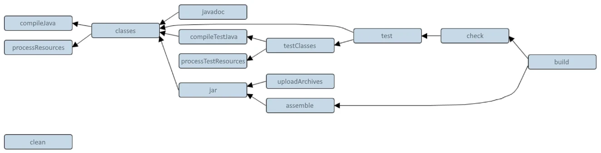

# **7. Build automation<br>[[ST 6](../Slide%20teoria/06.pdf?page=18)] ([VL 12](https://youtu.be/qe90rorNQuQ?t=1945))**

Gli strumenti di build automation servono a proteggere il progetto dalla creazione di versioni non funzionanti mediante l'automatizzazione della ricompilazione e del testing.

## **7.1. Make**

Make è un comando che nasce nel mondo unix e utilizza l'approccio unix (*pipeline*): si definiscono a livello di shell dei comandi che vanno eseguiti per ottenere certi obiettivi, questi non sono altro che la concatenazione di altri comandi che eseguono azioni più semplici.

Questo strumento è stato usato per realizzare la **compilazione incrementale**. 

Una volta, quando si modificava un singolo file sorgente, si ricompilava l'intero progetto perdendo molto tempo. In realtà questo non è necessario, basta ricompilare solo il file modificato e tutti quelli che dipendono da lui per poi rieseguire il linking. Tenere conto di tutte queste **dipendenze** in progetti di grandi dimensioni può essere molto complicato.

Si è quindi pensato di automatizzare il processo esplicitando all'interno di un file (chiamato **makefile**) tutte le dipendenze di ogni singolo file. Quando make viene eseguito controlla nell'ordine corretto le date dei vari file, se il sorgente è più recente del file oggetto, lo ricompila assieme a tutte le sue dipendenze.

La sintassi dei makefile è la seguente:

```make
obiettivo (è il nome di un file): dipendenze
    comandi da eseguire se l'obiettivo non è aggiornato 
```

Esempio di makefile:

```make
hellomake: hellomake.c hellofunc.c
    gcc -o hellomake hellomake.c hellofunc.c -I.
```

In questo caso, se il file eseguibile ```hellomake``` è meno recente di ```hellomake.c``` o ```hellofunc.c``` viene eseguito il comando specificato, che partendo dai sorgenti rigenera l'eseguibile.

Nei makefile si possono definire delle costanti che permettono di realizzare obiettivi e comandi più complessi:

```make
CC=gcc
CFLAGS=-I.

%.o: %.c $(DEPS)
    $(CC) -c -o $@ $< $(CFLAGS)

hellomake: hellomake.o hellofunc.o
    $(CC) -o hellomake hellomake.o hellofunc.o -I.
```

Il primo obiettivo di questo makefile definisce la possibilità di ottenere un file oggetto (.o) a partire da un file sorgente (.c) che ha lo stesso nome tramite l'esecuzione del comando specificato (l'opzione -c blocca il linking, esegue solo la compilazione). A questo punto l'eseguibile ```hellomake``` non dipende più dai sorgenti ma dai file oggetto.

Make permette di migliorare la portabilità ma non la garantisce del tutto, due macchine possono differire per moltissimi aspetti (compilatore, librerie, locazione dei file, versioni delle system call, ...). Tutte queste differenze (soprattutto quelle tra i vari "dialetti" di unix) hanno portato alla creazione di makefile molto complessi che consideravano tantissime variabili e situazioni. Inoltre, si rimane ad un livello d'astrazione molto basso (vicino a quello che si sarebbe fatto manualmente) e si è ancora molto proni ad errori. 

Successivamente sono stati creati degli strumenti che permettevano di generare i makefile partendo da descrizioni più astratte (automake, autoconf, imake), ma anche questa soluzione era poco efficiente.

## **7.2. Ant**

Ad un certo punto gli sviluppatori del progetto Tomcat (un webserver scritto in Java) decisero di usare Java per creare uno strumento che fosse in grado di prendere una descrizione delle dipendenze in XML (**build file**) e di invocare dei comandi, che non erano più dei comandi shell ma delle classi Java. In questo modo è possibile sfruttare l'astrazione fornita dalla JVM per ignorare diversi aspetti (separatore directory, comandi specifici, ...).

Nel luglio del 2000, Tomcat venne acquisito da Jakarta, che riconobbe l'utilità di questo strumento e decise di estrapolarlo, dandogli vita propria sotto il nome Ant.

Già dalla versione base Ant supportava nativamente l'interazione con molti altri strumenti come CVS (controllo nuove versioni prima della compilazione), Junit (esecuzione test), FTP (trasmissione al sito di deployment), JavaDOCS (generazione della documentazione), JAR e molti altri.

I build file definiscono un **project** composto da diversi **target** in cui sono elencati dei **task**, ovvero le istruzioni che svolgono effettivamente quel lavoro.
I target possono dipendere da altri target (*dipendenze a cascata*).

Esempio di build file:

```xml
<?xml version="1.0"?>
<project name="Hello" default="compile">
    <target name="clean" description="remove intermediate files">
        <delete dir="classes"/>
    </target>
    <target name="compile" description="compile the Java source code to class files">
        <mkdir dir="classes"/>
        <javac srcdir="." destdir="classes"/>
    </target>
    <target name="jar" depends="compile" description="create a Jar file for the application">
        <jar destfile="hello.jar">
            <fileset dir="classes" includes="**/*.class"/>
            <manifest>
                <attribute name="Main-Class" value="HelloProgram"/>
            </manifest>
        </jar>
    </target>
</project>
```

Ant non è soggetto ad invecchiamento perchè per soddisfare delle nuove necessità basta realizzare delle classi Java che implementino nuovi comandi (devono aderire a delle API), inoltre garantisce la portabilità completa.

## **7.3. Maven**

Maven provò a risolvere il problema delle dipendenze delle librerie esterne, particolarmente impattante nel mondo open source (venivano elencate in un readme). Venne creato un database contenente tutte le versioni di tutti i componenti comunemente usati, per scaricarli ed utilizzarli è sufficiente citarli all'interno del file di configurazione Maven.

Le varie aziende possono anche creare dei repository privati che contengno tutti i loro componenti proprietari utilizzati nei progetti interni.

## **7.4. Gradle**

Dato che Maven è molto prolisso e poco intuitivo da usare, è stato surclassato da Gradle, uno strumento che permette di fare più o meno le stesse cose ma in modo più semplice. Gradle si porta dietro molto del lavoro di Maven, infatti continua ad usare i suoi repository (in più offre la possibilità di usare archivi contenuti in cartelle condivise).

Caratteristiche di Gradle:
- al posto di XML si usano Groovy e Kotlin, due linguaggi di scripting simili a Java che vengono interpretati ed eseguiti direttamente dalla JVM. Non sono altro che dei DSL (Domain Specific Language) utilizzati per specificare le dipendenze e i task.
- permette di definire progetti che s'innestano (sottomoduli).
- è estendibile tramite l'aggiunta di vari plugin che permettono di trattare strumenti, situazioni e linguaggi mediante la definizione di task, regole e convenzioni. Questo permette di semplificare notevolmente il lavoro dello sviluppatore.
- ha un approccio dichiarativo e cerca di forzare l'uso di alcune convenzioni (build by convention). Non si è obbligati a rispettarle, ma farlo permette di risparmiarsi del lavoro.

Ad esempio, il plugin Java definisce una serie di source set convenzionali e di task con dipendenze:

Directory|Significato
--|--
src/main/java|Codice mandato in produzione
src/main/resources|Risorse testuali (file di configurazione, XML, ...)
src/test/java|Codice usato per testare il programma, generalmente non deve andare in produzione
src/test/resources|Risorse utilizzate nei test



Grazie alle sue caratteristiche, Gradle permette di trattare dei progetti molto complessi senza rendere difficile il lavoro su quelli molto semplici (scala bene in complessità, non obbliga ad usare cose complesse quando il progetto è semplice).

## **7.5. Bug tracking**

Gli strumenti di bug tracking sono nati prevalentemente in ambito open source (essendoci dei contributi più eterogenei e numerosi), questi hanno lo scopo di minimizzare ed ottimizzare le comunicazioni riguardanti i bug e le richieste di feature che avvengono tra lo sviluppatore ed il cliente (in alcuni casi il fatto che il programma non faccia una determinata cosa è un problema al pari di un bug).

Quest'ottimizzazione viene ottenuta:
- dando una struttura alle segnalazioni (template). Si richiede l'inserimento di una serie d'informazioni che devono essere il più complete possibili (versione usata, componenti installati, azioni esguite, log prodotto, ...).
- creando dei database in cui vengono memorizzati i bug scoperti. Prima di fare una nuova segnalazione, gli utenti dovrebbero controllare se il loro problema è già stato segnalato, se così fosse possono votare la segnalazione già esistente per fargli avere più rilevanza.

Esistono diversi modelli (anche piuttosto complicati) che permettono di gestire la vita dei bug, in genere prevedono le seguenti fasi:
- **new**: il bug è stato segnalato ma non è stato assegnato e verificato da nessuno.
- **verified**: l'esistenza del bug è stata verificata. Spesso le segnalazioni vengono chiuse in questa fase perchè:
    -  le informazioni ricevute non sono sufficienti per riprodurre il bug.
    - la segnalazione è duplicata.
    - gli sviluppatori non hanno intenzione di realizzare la funzionalità richiesta o non è negli scopi del progetto.
- **assigned to**: qualcuno ha ricevuto il compito (o si è preso l'impegno) di sviluppare una correzione.
- **fixed**: la correzione è presente in qualche ramo del progetto ma non ha ancora superato il controllo di QA.
- **fixed verify**: la correzione è arrivata al ramo main ed è stata distribuita.


Oggi esiste un collegamento abbastanza forte tra versioning e bug tracking. Tutti gli ambienti di hosting hanno introdotto un automatismo: se si crea un commit con messaggio "Fixed #X", la segnalazione numero X viene chiusa automaticamente.

---

Torna all'[indice degli argomenti](../README.md#indice-degli-argomenti)  
Capitolo successivo: [Refactoring](8%20Refactoring.md)  
Capitolo precedente: [Git](6%20Git.md)